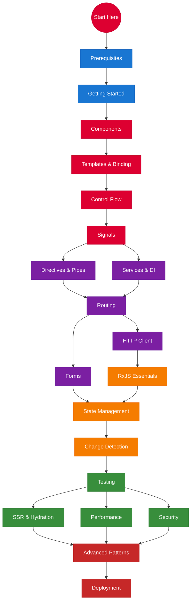

# Angular Mastery Guide

> A comprehensive, deeply interlinked guide to modern Angular — from first `ng new` to production-grade architecture.

This guide covers **Angular 17+** patterns: standalone components, signals, new control flow, SSR with hydration, and zoneless change detection. Legacy patterns (NgModules, `*ngIf`, Zone.js) are referenced only for migration context.

---

## Learning Roadmap

**Legend:**
- **Blue** = Prerequisites & Setup
- **Red** = Core Fundamentals
- **Purple** = Building Real Apps
- **Orange** = Intermediate Patterns
- **Green** = Production Quality
- **Dark Red** = Advanced & Deployment

---

## Quick Navigation

### Foundations

| # | Topic | Level | Description |
|---|-------|-------|-------------|
| 00 | [Prerequisites](docs/00-prerequisites.md) | Beginner | TypeScript, tooling, and dev environment |
| 01 | [Getting Started](docs/01-getting-started.md) | Beginner | CLI, project structure, first app |
| 02 | [Components](docs/02-components.md) | Beginner | The building blocks of Angular |
| 03 | [Templates & Data Binding](docs/03-templates-and-binding.md) | Beginner | Interpolation, property/event/two-way binding |
| 04 | [Control Flow](docs/04-control-flow.md) | Beginner | @if, @for, @switch, @let, @defer |
| 05 | [Signals](docs/05-signals.md) | Beginner | Reactive state with signal(), computed(), effect() |

### Building Applications

| # | Topic | Level | Description |
|---|-------|-------|-------------|
| 06 | [Directives & Pipes](docs/06-directives-and-pipes.md) | Beginner | Built-in and custom directives, data transformation |
| 07 | [Services & Dependency Injection](docs/07-services-and-di.md) | Intermediate | Sharing logic and data across components |
| 08 | [Routing](docs/08-routing.md) | Intermediate | Navigation, guards, lazy loading |
| 09 | [Forms](docs/09-forms.md) | Intermediate | Template-driven and reactive forms |
| 10 | [HTTP Client](docs/10-http-client.md) | Intermediate | API calls, interceptors, httpResource() |

### Intermediate Patterns

| # | Topic | Level | Description |
|---|-------|-------|-------------|
| 11 | [RxJS Essentials](docs/11-rxjs.md) | Intermediate | Observables, operators, and patterns for Angular |
| 12 | [State Management](docs/12-state-management.md) | Intermediate | From signals in services to NgRx SignalStore |
| 13 | [Change Detection](docs/13-change-detection.md) | Intermediate | How Angular updates the DOM |

### Production Quality

| # | Topic | Level | Description |
|---|-------|-------|-------------|
| 14 | [Testing](docs/14-testing.md) | Intermediate | Unit tests with Vitest, E2E with Playwright |
| 15 | [SSR & Hydration](docs/15-ssr-and-hydration.md) | Advanced | Server-side rendering, SSG, incremental hydration |
| 16 | [Performance](docs/16-performance.md) | Advanced | Lazy loading, @defer, image optimization, OnPush |
| 17 | [Security](docs/17-security.md) | Advanced | XSS prevention, CSRF, sanitization |

### Mastery

| # | Topic | Level | Description |
|---|-------|-------|-------------|
| 18 | [Advanced Patterns](docs/18-advanced-patterns.md) | Advanced | Zoneless, dynamic components, animations, i18n |
| 19 | [Deployment](docs/19-deployment.md) | Advanced | Build optimization, CI/CD, hosting |

### Reference

| Topic | Description |
|-------|-------------|
| [Cheatsheet](docs/cheatsheet.md) | Quick-reference for syntax and patterns |
| [Glossary](docs/glossary.md) | Definitions of Angular terms |
| [Signals vs RxJS](docs/signals-vs-rxjs.md) | When to use which reactive primitive |

---

## Recommended Free Resources

This guide links out to the best free Angular content on the web. Every page includes curated links to official docs, YouTube videos, and interactive tools — we'd rather point you to an excellent existing resource than reinvent it.

### Top YouTube Channels for Modern Angular

| Channel | Why Follow |
|---------|-----------|
| [Joshua Morony](https://www.youtube.com/@JoshuaMorony) | The best channel for modern Angular. Short, focused videos on signals, standalone components, and reactive patterns. Consistently ahead of the curve. |
| [Decoded Frontend](https://www.youtube.com/@DecodedFrontend) | Deep dives into Angular internals. Excellent on change detection, DI, and performance. Thorough, accurate, well-structured. |
| [Deborah Kurata](https://www.youtube.com/@debaborahkurata) | Exceptional coverage of signals and reactive data patterns. Clear, methodical teaching style. Her signals playlist is a gold-standard learning path. |
| [Rainer Hahnekamp](https://www.youtube.com/@RainerHahnekamp) | The authority on Angular testing and NgRx Signal Store. One of the few channels with deep, practical testing content. |
| [Angular](https://www.youtube.com/@Angular) | Official channel. Keynotes, release overviews, and feature deep dives from the core team. |

### Essential Bookmarks

| Resource | What It Is |
|----------|-----------|
| [angular.dev](https://angular.dev) | Official docs — rewritten for modern Angular with interactive tutorials |
| [Angular Playground](https://angular.dev/playground) | Write and run Angular code in the browser, zero setup |
| [RxJS Marbles](https://rxmarbles.com/) | Interactive marble diagrams for every RxJS operator |
| [NgRx Signal Store Docs](https://ngrx.io/guide/signals/signal-store) | Official docs for the modern Angular state management library |
| [OWASP Angular Cheat Sheet](https://cheatsheetseries.owasp.org/cheatsheets/Angular_Cheat_Sheet.html) | Security checklist maintained by OWASP |

---

## How to Use This Guide

**Complete beginner?** Start at [Prerequisites](docs/00-prerequisites.md) and follow the numbered sequence.

**Know another framework?** Skim [Getting Started](docs/01-getting-started.md), then jump to [Components](docs/02-components.md) and [Signals](docs/05-signals.md).

**Experienced Angular dev upgrading?** Head straight to [Signals](docs/05-signals.md), [Control Flow](docs/04-control-flow.md), and [Advanced Patterns](docs/18-advanced-patterns.md).

**Need a quick answer?** Use the [Cheatsheet](docs/cheatsheet.md) or [Glossary](docs/glossary.md).

Every page links forward, backward, and sideways to related concepts. Follow the links that match your curiosity.

---

## About This Guide

Built for Angular 19+ with modern patterns as the default. Each topic includes:

- **Explanations** at multiple depth levels
- **Code examples** you can copy and adapt
- **Mermaid diagrams** for architecture and data flow
- **Cross-links** to related concepts throughout
- **Key takeaways** summarizing each section

---

*Contributions welcome. If you find an error or want to add a topic, open a PR.*
