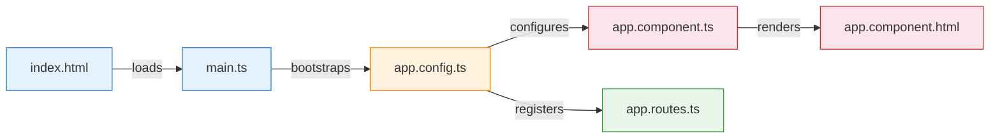

# Getting Started

[&larr; Prerequisites](00-prerequisites.md) | [Next: Components &rarr;](02-components.md)

---

This guide walks you through creating your first Angular application and understanding what every file does.

## Table of Contents

- [Creating a New Project](#creating-a-new-project)
- [Project Structure](#project-structure)
- [How Angular Bootstraps](#how-angular-bootstraps)
- [The Development Server](#the-development-server)
- [Your First Change](#your-first-change)
- [Key Takeaways](#key-takeaways)

---

## Creating a New Project

```bash
ng new my-app
```

The CLI will ask you a few questions:

| Question | Recommended Answer | Why |
|----------|-------------------|-----|
| Stylesheet format | **CSS** (or SCSS if you prefer) | SCSS adds nesting and variables |
| SSR / SSG | **No** (for learning) | Keeps things simple at first |

```bash
cd my-app
ng serve
```

Open `http://localhost:4200` in your browser. You should see the Angular welcome page.

---

## Project Structure

```
my-app/
├── src/
│   ├── app/
│   │   ├── app.component.ts        # Root component
│   │   ├── app.component.html       # Root template
│   │   ├── app.component.css        # Root styles
│   │   ├── app.component.spec.ts    # Root component tests
│   │   ├── app.config.ts            # Application configuration
│   │   └── app.routes.ts            # Route definitions
│   ├── index.html                   # Entry HTML file
│   ├── main.ts                      # Bootstrap entry point
│   └── styles.css                   # Global styles
├── angular.json                     # CLI configuration
├── tsconfig.json                    # TypeScript configuration
├── package.json                     # Dependencies
└── ...
```

### What Each File Does



---

## How Angular Bootstraps

### Step 1: `index.html`

The single HTML page that hosts your entire app:

```html
<!doctype html>
<html lang="en">
<head>
  <meta charset="utf-8">
  <title>MyApp</title>
</head>
<body>
  <app-root></app-root>  <!-- Angular renders here -->
</body>
</html>
```

### Step 2: `main.ts`

The entry point that starts Angular:

```typescript
import { bootstrapApplication } from '@angular/platform-browser';
import { appConfig } from './app/app.config';
import { AppComponent } from './app/app.component';

bootstrapApplication(AppComponent, appConfig)
  .catch((err) => console.error(err));
```

> **Key concept:** `bootstrapApplication()` is how modern Angular starts. It takes a standalone component and a configuration object. There is no `AppModule` — that's the legacy approach. See [Advanced Patterns](18-advanced-patterns.md) for NgModule context.

### Step 3: `app.config.ts`

Application-wide providers and configuration:

```typescript
import { ApplicationConfig, provideZoneChangeDetection } from '@angular/core';
import { provideRouter } from '@angular/router';
import { routes } from './app.routes';

export const appConfig: ApplicationConfig = {
  providers: [
    provideZoneChangeDetection({ eventCoalescing: true }),
    provideRouter(routes)
  ]
};
```

This is where you register framework features using `provide*()` functions:

| Function | Purpose | Related Guide |
|----------|---------|---------------|
| `provideRouter()` | Enable routing | [Routing](08-routing.md) |
| `provideHttpClient()` | Enable HTTP requests | [HTTP Client](10-http-client.md) |
| `provideAnimations()` | Enable animations | [Advanced Patterns](18-advanced-patterns.md) |
| `provideZoneChangeDetection()` | Configure change detection | [Change Detection](13-change-detection.md) |

### Step 4: `app.component.ts`

The root component — the top of your component tree:

```typescript
import { Component } from '@angular/core';
import { RouterOutlet } from '@angular/router';

@Component({
  selector: 'app-root',
  imports: [RouterOutlet],
  templateUrl: './app.component.html',
  styleUrl: './app.component.css'
})
export class AppComponent {
  title = 'my-app';
}
```

> Learn more about how components work in [Components](02-components.md).

---

## The Development Server

```bash
ng serve
```

This starts a local development server with:

- **Hot Module Replacement (HMR)** — changes appear instantly without full page reload
- **Vite + esbuild** — the modern Angular build system (up to 87% faster than the old Webpack setup)
- **TypeScript checking** — errors appear in the terminal and browser console

Useful flags:

```bash
ng serve --open           # Auto-open browser
ng serve --port 3000      # Use a different port
ng serve --host 0.0.0.0   # Allow network access
```

---

## Your First Change

1. Open `src/app/app.component.html`
2. Replace its contents with:

```html
<h1>Hello, {{ title }}!</h1>
<p>Angular is running.</p>
```

3. Open `src/app/app.component.ts` and change the title:

```typescript
export class AppComponent {
  title = 'Angular Learner';
}
```

4. Save both files. The browser updates automatically.

The `{{ title }}` syntax is called **interpolation** — it displays the value of a component property in the template. You'll learn much more about this in [Templates & Data Binding](03-templates-and-binding.md).

---

## Angular CLI Generators

The CLI generates code for you, following Angular conventions:

```bash
ng generate component header        # or: ng g c header
ng generate service data            # or: ng g s data
ng generate pipe format-date        # or: ng g p format-date
ng generate directive highlight     # or: ng g d highlight
ng generate guard auth              # or: ng g guard auth
```

Each generator creates the right files in the right place with the right boilerplate. Use them.

---

## Key Takeaways

- `ng new` creates a standalone, module-free project by default
- The bootstrap chain: `index.html` → `main.ts` → `app.config.ts` → `AppComponent`
- `app.config.ts` is where you register framework features with `provide*()` functions
- The dev server uses **Vite + esbuild** for fast builds and HMR
- Always use `ng generate` to create new components, services, etc.

---

[&larr; Prerequisites](00-prerequisites.md) | [Next: Components &rarr;](02-components.md)
