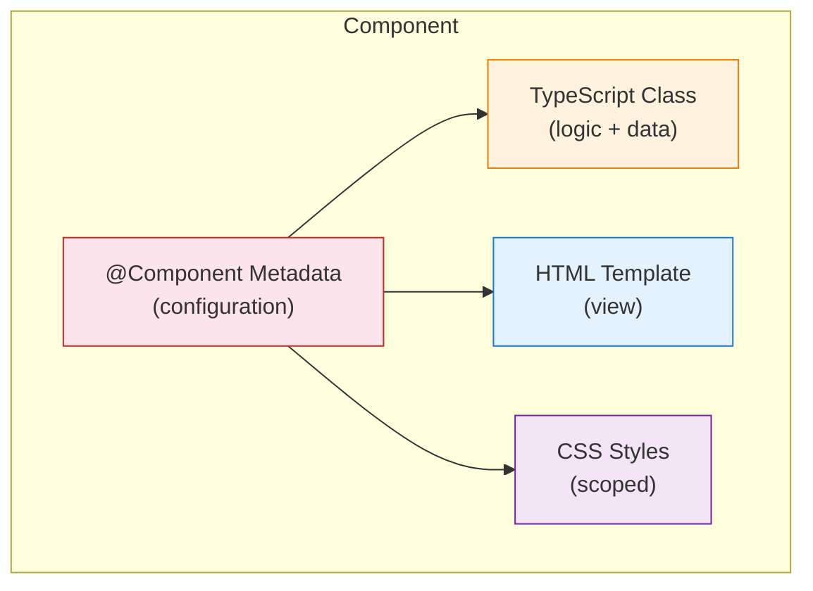
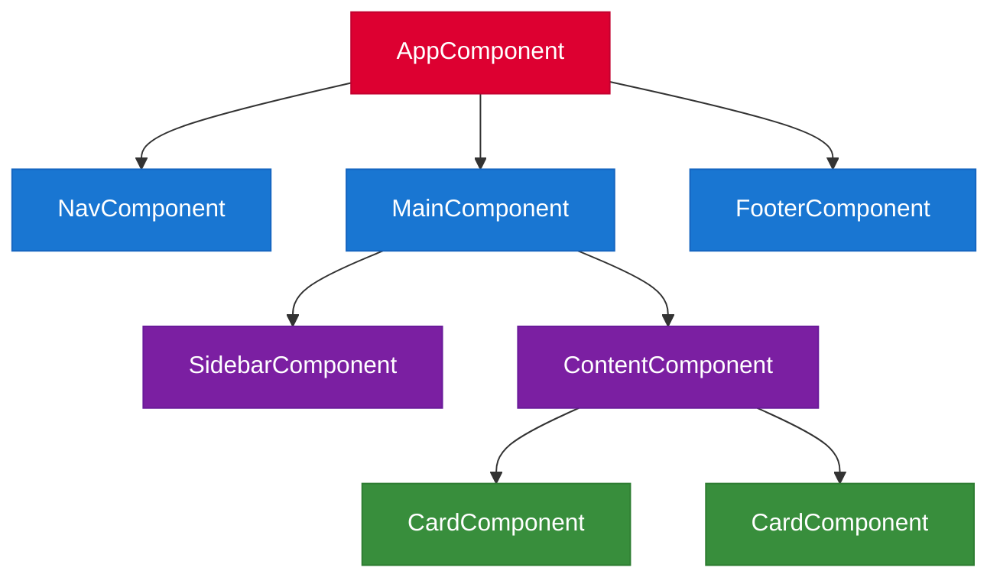
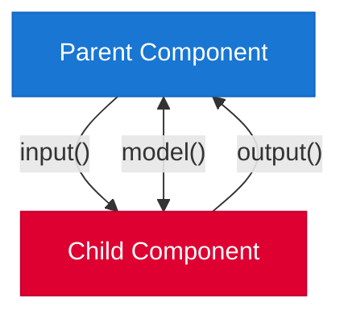
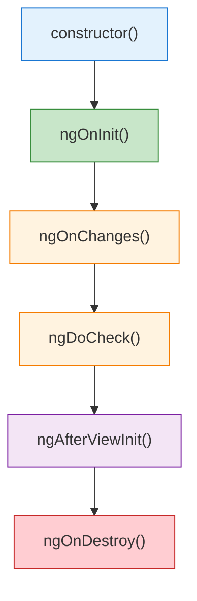

# Components

[&larr; Getting Started](01-getting-started.md) | [Next: Templates & Data Binding &rarr;](03-templates-and-binding.md)

---

Components are the fundamental building blocks of Angular applications. Every Angular app is a tree of components, starting from a root component.

## Table of Contents

- [What Is a Component?](#what-is-a-component)
- [Creating Components](#creating-components)
- [Anatomy of a Component](#anatomy-of-a-component)
- [Component Communication](#component-communication)
- [Lifecycle Hooks](#lifecycle-hooks)
- [Content Projection](#content-projection)
- [View Queries](#view-queries)
- [Key Takeaways](#key-takeaways)

---

## What Is a Component?

A component controls a piece of the screen. It combines:

- A **TypeScript class** — the logic and data
- An **HTML template** — the view
- **CSS styles** — scoped styling
- **Metadata** — configuration via the `@Component` decorator



### The Component Tree

Your entire UI is a tree of nested components:



---

## Creating Components

### Using the CLI (recommended)

```bash
ng generate component user-profile
# Shorthand:
ng g c user-profile
```

This creates:

```
src/app/user-profile/
├── user-profile.component.ts
├── user-profile.component.html
├── user-profile.component.css
└── user-profile.component.spec.ts
```

### Manual Creation

```typescript
// user-profile.component.ts
import { Component } from '@angular/core';

@Component({
  selector: 'app-user-profile',
  templateUrl: './user-profile.component.html',
  styleUrl: './user-profile.component.css'
})
export class UserProfileComponent {
  name = 'Ada Lovelace';
}
```

```html
<!-- user-profile.component.html -->
<div class="profile">
  <h2>{{ name }}</h2>
</div>
```

---

## Anatomy of a Component

### The `@Component` Decorator

```typescript
@Component({
  selector: 'app-user-profile',      // HTML tag name
  templateUrl: './user-profile.component.html',  // or inline: template: `<h1>Hi</h1>`
  styleUrl: './user-profile.component.css',      // or inline: styles: [`h1 { color: red }`]
  imports: [CommonModule, RouterLink], // dependencies this component uses
})
export class UserProfileComponent {
  // component logic here
}
```

| Property | Purpose |
|----------|---------|
| `selector` | The custom HTML tag (`<app-user-profile>`) |
| `template` / `templateUrl` | Inline template or path to HTML file |
| `styles` / `styleUrl` | Inline styles or path to CSS file |
| `imports` | Other components, directives, pipes this component uses |

### Standalone Components

Since Angular 19, all components are standalone by default. A standalone component declares its own dependencies in the `imports` array instead of relying on an NgModule.

```typescript
import { Component } from '@angular/core';
import { DatePipe } from '@angular/common';
import { UserAvatarComponent } from './user-avatar.component';

@Component({
  selector: 'app-user-profile',
  imports: [DatePipe, UserAvatarComponent],  // declare what you use
  template: `
    <app-user-avatar />
    <p>Joined: {{ joinDate | date:'mediumDate' }}</p>
  `
})
export class UserProfileComponent {
  joinDate = new Date();
}
```

> **Why standalone?** It removes the complexity of NgModules for most use cases. Each component is self-contained and explicitly declares what it needs. See [Advanced Patterns](18-advanced-patterns.md) for NgModule migration context.

### Using a Component

Once created, use the component by its selector in any parent template:

```html
<!-- In the parent component's template -->
<app-user-profile />
```

The parent must import the child in its `imports` array:

```typescript
@Component({
  selector: 'app-dashboard',
  imports: [UserProfileComponent],  // import the child
  template: `<app-user-profile />`
})
export class DashboardComponent {}
```

---

## Component Communication

Components need to exchange data. Angular provides clear patterns for this:



### Passing Data Down with `input()`

The modern way to receive data from a parent:

```typescript
// child.component.ts
import { Component, input } from '@angular/core';

@Component({
  selector: 'app-user-card',
  template: `
    <div class="card">
      <h3>{{ name() }}</h3>
      <p>{{ role() }}</p>
    </div>
  `
})
export class UserCardComponent {
  name = input.required<string>();    // must be provided by parent
  role = input<string>('Member');     // optional with default value
}
```

```html
<!-- parent template -->
<app-user-card [name]="'Ada Lovelace'" [role]="'Admin'" />
```

> **Note:** `input()` returns a signal. You read its value by calling it as a function: `name()`. See [Signals](05-signals.md) for more on this.

### Sending Events Up with `output()`

```typescript
// child.component.ts
import { Component, output } from '@angular/core';

@Component({
  selector: 'app-user-card',
  template: `<button (click)="onDelete()">Delete</button>`
})
export class UserCardComponent {
  deleted = output<number>();  // emits the user's ID

  onDelete() {
    this.deleted.emit(42);
  }
}
```

```html
<!-- parent template -->
<app-user-card (deleted)="handleDelete($event)" />
```

```typescript
// parent.component.ts
handleDelete(userId: number) {
  console.log(`Deleting user ${userId}`);
}
```

### Two-Way Binding with `model()`

For values that both parent and child can modify:

```typescript
// child.component.ts
import { Component, model } from '@angular/core';

@Component({
  selector: 'app-toggle',
  template: `
    <button (click)="enabled.set(!enabled())">
      {{ enabled() ? 'ON' : 'OFF' }}
    </button>
  `
})
export class ToggleComponent {
  enabled = model<boolean>(false);
}
```

```html
<!-- parent template -->
<app-toggle [(enabled)]="isFeatureEnabled" />
```

> `model()` creates a writable signal that syncs with the parent. Learn about the `[( )]` banana-in-a-box syntax in [Templates & Data Binding](03-templates-and-binding.md).

### Quick Reference: Communication Patterns

| Pattern | Direction | API | Use Case |
|---------|-----------|-----|----------|
| `input()` | Parent → Child | `input<T>()`, `input.required<T>()` | Passing data down |
| `output()` | Child → Parent | `output<T>()` | Emitting events up |
| `model()` | Parent ↔ Child | `model<T>()` | Two-way binding |
| [Service](07-services-and-di.md) | Any ↔ Any | `inject()` | Shared state between unrelated components |

---

## Lifecycle Hooks

Angular calls lifecycle hooks at specific moments in a component's existence:



### The Most Important Hooks

| Hook | When | Common Use |
|------|------|------------|
| `ngOnInit()` | After first input bindings set | Fetch data, initialize logic |
| `ngOnChanges(changes)` | When input values change | React to input changes |
| `ngAfterViewInit()` | After view (and children) initialized | Access DOM elements |
| `ngOnDestroy()` | Before component is removed | Unsubscribe, clean up timers |

```typescript
import { Component, OnInit, OnDestroy, input } from '@angular/core';

@Component({
  selector: 'app-user-detail',
  template: `<h2>{{ name() }}</h2>`
})
export class UserDetailComponent implements OnInit, OnDestroy {
  name = input.required<string>();

  ngOnInit() {
    console.log('Component initialized with name:', this.name());
  }

  ngOnDestroy() {
    console.log('Component destroyed — clean up here');
  }
}
```

> **Modern alternative:** With [Signals](05-signals.md), you often don't need `ngOnChanges`. Use `computed()` or `effect()` instead. And `DestroyRef` can replace `ngOnDestroy`. See [Advanced Patterns](18-advanced-patterns.md).

---

## Content Projection

Content projection lets a parent inject content *into* a child component — similar to "slots" in other frameworks.

### Single-Slot Projection

```typescript
// card.component.ts
@Component({
  selector: 'app-card',
  template: `
    <div class="card">
      <ng-content />  <!-- projected content appears here -->
    </div>
  `
})
export class CardComponent {}
```

```html
<!-- parent template -->
<app-card>
  <h3>This heading is projected into the card</h3>
  <p>So is this paragraph.</p>
</app-card>
```

### Multi-Slot Projection

```typescript
// card.component.ts
@Component({
  selector: 'app-card',
  template: `
    <div class="card">
      <header><ng-content select="[card-header]" /></header>
      <div class="body"><ng-content /></div>
      <footer><ng-content select="[card-footer]" /></footer>
    </div>
  `
})
export class CardComponent {}
```

```html
<!-- parent template -->
<app-card>
  <h3 card-header>Card Title</h3>
  <p>This goes in the default slot (body).</p>
  <button card-footer>Action</button>
</app-card>
```

---

## View Queries

Access child elements or components from the parent class using signal-based queries:

### `viewChild()` — Query a Single Element

```typescript
import { Component, viewChild, ElementRef, AfterViewInit } from '@angular/core';

@Component({
  selector: 'app-search',
  template: `<input #searchInput placeholder="Search..." />`
})
export class SearchComponent implements AfterViewInit {
  searchInput = viewChild.required<ElementRef>('searchInput');

  ngAfterViewInit() {
    this.searchInput().nativeElement.focus();
  }
}
```

### `viewChildren()` — Query Multiple Elements

```typescript
import { Component, viewChildren } from '@angular/core';
import { UserCardComponent } from './user-card.component';

@Component({
  selector: 'app-user-list',
  imports: [UserCardComponent],
  template: `
    @for (user of users; track user.id) {
      <app-user-card [name]="user.name" />
    }
  `
})
export class UserListComponent {
  users = [{ id: 1, name: 'Ada' }, { id: 2, name: 'Grace' }];
  cards = viewChildren(UserCardComponent);
}
```

### `contentChild()` and `contentChildren()`

Same as view queries but for **projected** content (via `<ng-content>`):

```typescript
@Component({
  selector: 'app-tabs',
  template: `<ng-content />`
})
export class TabsComponent {
  tabs = contentChildren(TabComponent);
}
```

---

## Key Takeaways

- Components = TypeScript class + HTML template + CSS styles + `@Component` metadata
- Every Angular app is a **tree of components** starting from a root
- **Standalone components** (default since v19) declare their own dependencies via `imports`
- **Communication:** `input()` for data down, `output()` for events up, `model()` for two-way
- **Lifecycle hooks:** `ngOnInit` for setup, `ngOnDestroy` for cleanup
- **Content projection** (`<ng-content>`) enables flexible, reusable layouts
- **View queries** (`viewChild`, `contentChild`) give programmatic access to the DOM

---

**Related:**
- [Templates & Data Binding](03-templates-and-binding.md) — how templates display component data
- [Signals](05-signals.md) — the reactive primitive powering `input()`, `output()`, and `model()`
- [Services & DI](07-services-and-di.md) — sharing data between unrelated components

---

[&larr; Getting Started](01-getting-started.md) | [Next: Templates & Data Binding &rarr;](03-templates-and-binding.md)
