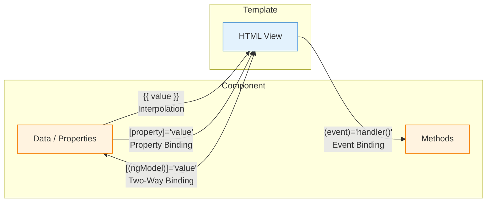

# Templates & Data Binding

[&larr; Components](02-components.md) | [Next: Control Flow &rarr;](04-control-flow.md)

---

Templates are the HTML that defines how a component renders. Data binding connects the template to the component's data and logic.

## Table of Contents

- [Interpolation](#interpolation)
- [Property Binding](#property-binding)
- [Event Binding](#event-binding)
- [Two-Way Binding](#two-way-binding)
- [Template Reference Variables](#template-reference-variables)
- [Attribute, Class, and Style Binding](#attribute-class-and-style-binding)
- [Key Takeaways](#key-takeaways)

---

## The Four Types of Data Binding



---

## Interpolation

Display component data in the template using double curly braces:

```typescript
@Component({
  selector: 'app-greeting',
  template: `
    <h1>Hello, {{ name }}!</h1>
    <p>You have {{ messageCount }} messages.</p>
    <p>{{ getGreeting() }}</p>
    <p>Total: {{ price * quantity }}</p>
  `
})
export class GreetingComponent {
  name = 'Ada';
  messageCount = 5;
  price = 9.99;
  quantity = 3;

  getGreeting() {
    return `Welcome back, ${this.name}!`;
  }
}
```

**What works inside `{{ }}`:**
- Properties: `{{ name }}`
- Method calls: `{{ getFullName() }}`
- Expressions: `{{ price * 1.2 }}`
- Ternary: `{{ isAdmin ? 'Admin' : 'User' }}`
- Pipes: `{{ date | date:'short' }}` (see [Directives & Pipes](06-directives-and-pipes.md))

**What does NOT work:**
- Assignments: `{{ x = 5 }}` — not allowed
- `new` keyword: `{{ new Date() }}` — not allowed
- Chained expressions: `{{ a; b }}` — not allowed

---

## Property Binding

Bind component data to HTML element properties using square brackets:

```typescript
@Component({
  selector: 'app-image',
  template: `
    <!-- Bind to element properties -->
    
    <button [disabled]="isLoading">Submit</button>
    <div [hidden]="!showDetails">Details here...</div>

    <!-- Bind to component inputs -->
    <app-user-card [name]="currentUser.name" [role]="currentUser.role" />
  `
})
export class ImageComponent {
  imageUrl = 'https://example.com/photo.jpg';
  imageAlt = 'Profile photo';
  isLoading = false;
  showDetails = true;
  currentUser = { name: 'Ada', role: 'Admin' };
}
```

### When to Use Interpolation vs Property Binding

| Scenario | Use | Example |
|----------|-----|---------|
| Displaying text | Interpolation | `{{ name }}` |
| Setting non-string properties | Property binding | `[disabled]="isTrue"` |
| Setting element attributes | Property binding | `[src]="url"` |
| Component inputs | Property binding | `[name]="value"` |

> **Tip:** `` and `` produce the same result for strings. Property binding is preferred because it works for all types (booleans, objects, etc.).

---

## Event Binding

Respond to user actions using parentheses:

```typescript
@Component({
  selector: 'app-counter',
  template: `
    <p>Count: {{ count }}</p>
    <button (click)="increment()">+1</button>
    <button (click)="count = 0">Reset</button>
    
    <input (input)="onInput($event)" />
    <input (keyup.enter)="onSubmit()" />
  `
})
export class CounterComponent {
  count = 0;

  increment() {
    this.count++;
  }

  onInput(event: Event) {
    const input = event.target as HTMLInputElement;
    console.log(input.value);
  }

  onSubmit() {
    console.log('Enter pressed!');
  }
}
```

### Common Events

| Event | Triggers When |
|-------|--------------|
| `(click)` | Element is clicked |
| `(dblclick)` | Element is double-clicked |
| `(input)` | Input value changes |
| `(keyup)` | Key is released |
| `(keyup.enter)` | Enter key specifically |
| `(keydown.escape)` | Escape key specifically |
| `(submit)` | Form is submitted |
| `(focus)` / `(blur)` | Element gains / loses focus |
| `(mouseenter)` / `(mouseleave)` | Mouse enters / leaves element |

### The `$event` Object

`$event` gives you the raw DOM event:

```html
<input (input)="onInput($event)" />
<div (click)="onClick($event)">Click me</div>
```

```typescript
onInput(event: Event) {
  const value = (event.target as HTMLInputElement).value;
}

onClick(event: MouseEvent) {
  console.log(`Clicked at (${event.clientX}, ${event.clientY})`);
}
```

---

## Two-Way Binding

Two-way binding keeps a property and an input element in sync. Changes flow in both directions.

### With `ngModel` (for form elements)

```typescript
import { Component } from '@angular/core';
import { FormsModule } from '@angular/forms';

@Component({
  selector: 'app-search',
  imports: [FormsModule],
  template: `
    <input [(ngModel)]="searchTerm" placeholder="Search..." />
    <p>Searching for: {{ searchTerm }}</p>
  `
})
export class SearchComponent {
  searchTerm = '';
}
```

The `[( )]` syntax (called "banana in a box") is shorthand for:

```html
<!-- These are equivalent: -->
<input [(ngModel)]="searchTerm" />
<input [ngModel]="searchTerm" (ngModelChange)="searchTerm = $event" />
```

### With Custom Components using `model()`

```html
<!-- Parent template -->
<app-toggle [(enabled)]="isActive" />
```

This works because the child component uses `model()` — see [Components: Two-Way Binding](02-components.md#two-way-binding-with-model).

> **Requires FormsModule.** Two-way binding with `ngModel` requires importing `FormsModule`. See [Forms](09-forms.md) for full details.

---

## Template Reference Variables

Mark elements with `#` to reference them elsewhere in the template:

```html
<input #nameInput type="text" />
<button (click)="greet(nameInput.value)">Greet</button>

<!-- Reference a component instance -->
<app-counter #counter />
<button (click)="counter.increment()">Increment from parent template</button>
```

Template reference variables are scoped to the template. To access them from the component class, use `viewChild()` — see [Components: View Queries](02-components.md#view-queries).

---

## Attribute, Class, and Style Binding

### Attribute Binding

For HTML attributes that don't have a corresponding DOM property:

```html
<td [attr.colspan]="columnSpan">Merged cell</td>
<button [attr.aria-label]="buttonLabel">Click</button>
```

### Class Binding

```html
<!-- Toggle a single class -->
<div [class.active]="isActive">Tab</div>
<div [class.error]="hasError">Message</div>

<!-- Set multiple classes -->
<div [class]="currentClasses">Content</div>
```

```typescript
// In the component
isActive = true;
hasError = false;
currentClasses = 'card highlighted';
```

### Style Binding

```html
<!-- Single style property -->
<div [style.color]="textColor">Colored text</div>
<div [style.width.px]="boxWidth">Sized box</div>
<div [style.font-size.em]="fontSize">Sized text</div>

<!-- Multiple styles -->
<div [style]="'color: red; font-size: 16px'">Styled</div>
```

```typescript
textColor = 'navy';
boxWidth = 200;
fontSize = 1.5;
```

---

## Putting It All Together

Here's a component that uses all binding types:

```typescript
import { Component } from '@angular/core';
import { FormsModule } from '@angular/forms';

@Component({
  selector: 'app-product-card',
  imports: [FormsModule],
  template: `
    <div class="card" [class.featured]="isFeatured">
      
      <h3>{{ product.name }}</h3>
      <p [style.color]="priceColor">{{ product.price | currency }}</p>
      
      <label>
        Quantity:
        <input type="number" [(ngModel)]="quantity" min="1" />
      </label>
      
      <p>Total: {{ product.price * quantity | currency }}</p>
      
      <button 
        [disabled]="quantity < 1" 
        (click)="addToCart()">
        Add to Cart
      </button>
    </div>
  `
})
export class ProductCardComponent {
  product = { name: 'Widget', price: 29.99, imageUrl: '/widget.jpg' };
  quantity = 1;
  isFeatured = true;

  get priceColor() {
    return this.product.price > 50 ? 'red' : 'green';
  }

  addToCart() {
    console.log(`Added ${this.quantity} ${this.product.name}(s) to cart`);
  }
}
```

---

## Key Takeaways

| Binding Type | Syntax | Direction | Example |
|-------------|--------|-----------|---------|
| Interpolation | `{{ }}` | Component → Template | `{{ name }}` |
| Property | `[ ]` | Component → Template | `[src]="url"` |
| Event | `( )` | Template → Component | `(click)="handler()"` |
| Two-way | `[( )]` | Both | `[(ngModel)]="value"` |

- **Interpolation** for displaying text
- **Property binding** for setting element/component properties
- **Event binding** for handling user actions
- **Two-way binding** for keeping values in sync (forms, custom components)
- **Template reference variables** (`#ref`) for accessing elements in the template

---

**Related:**
- [Control Flow](04-control-flow.md) — conditional and repeated rendering
- [Directives & Pipes](06-directives-and-pipes.md) — transform displayed data
- [Forms](09-forms.md) — deep dive into form binding

---

[&larr; Components](02-components.md) | [Next: Control Flow &rarr;](04-control-flow.md)
