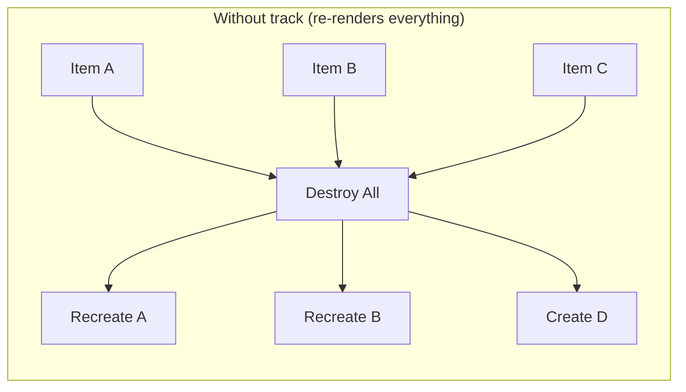
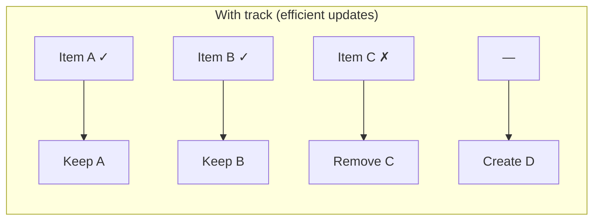
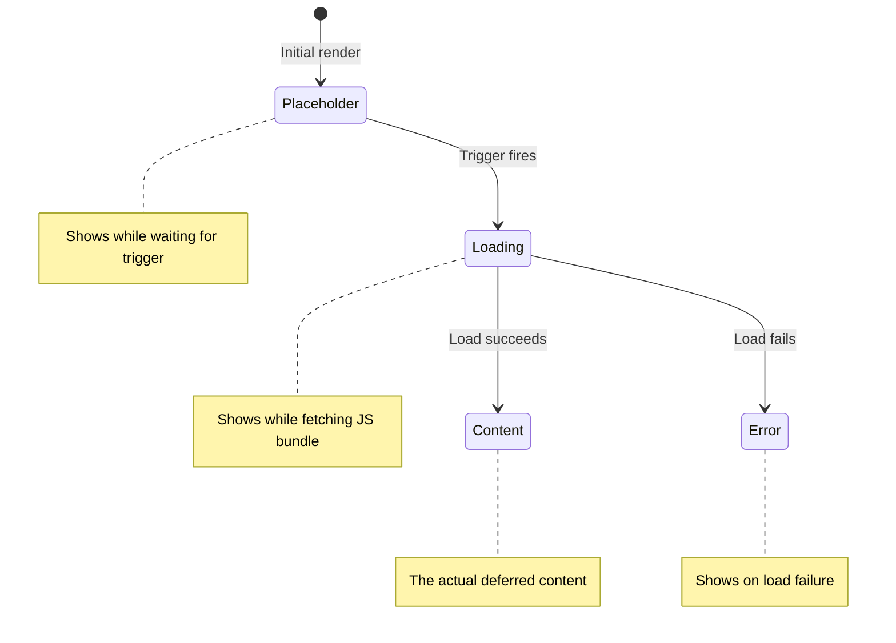

# Control Flow

[&larr; Templates & Data Binding](03-templates-and-binding.md) | [Next: Signals &rarr;](05-signals.md)

---

Angular's built-in control flow blocks let you conditionally render, loop over, and switch on data — all directly in your templates. Introduced in Angular 17, these replace the older `*ngIf`, `*ngFor`, and `*ngSwitch` directives.

## Table of Contents

- [@if — Conditional Rendering](#if--conditional-rendering)
- [@for — Repeating Content](#for--repeating-content)
- [@switch — Pattern Matching](#switch--pattern-matching)
- [@let — Template Variables](#let--template-variables)
- [@defer — Lazy Loading Blocks](#defer--lazy-loading-blocks)
- [Migration from Legacy Syntax](#migration-from-legacy-syntax)
- [Key Takeaways](#key-takeaways)

---

## @if — Conditional Rendering

Show or hide content based on a condition:

```html
@if (isLoggedIn) {
  <p>Welcome back, {{ username }}!</p>
} @else {
  <p>Please log in.</p>
}
```

### With `@else if`

```html
@if (role === 'admin') {
  <app-admin-dashboard />
} @else if (role === 'editor') {
  <app-editor-dashboard />
} @else {
  <app-viewer-dashboard />
}
```

### Capturing a Value

Use `as` to capture an expression result for use in the block:

```html
@if (currentUser(); as user) {
  <p>Hello, {{ user.name }}!</p>
  <p>Email: {{ user.email }}</p>
}
```

This is especially useful with [Signals](05-signals.md) — you call the signal once and reuse the result.

---

## @for — Repeating Content

Loop over collections to render repeated content:

```html
@for (user of users; track user.id) {
  <app-user-card [name]="user.name" [email]="user.email" />
} @empty {
  <p>No users found.</p>
}
```

### The `track` Expression (Required)

Every `@for` loop **must** include a `track` expression. This tells Angular how to identify each item so it can efficiently update the DOM when the list changes.

```html
<!-- Track by a unique property (recommended) -->
@for (item of items; track item.id) { ... }

<!-- Track by the item itself (for primitives or immutable objects) -->
@for (name of names; track name) { ... }

<!-- Track by index (use sparingly — poor for reordering) -->
@for (item of items; track $index) { ... }
```





### Implicit Variables

Inside `@for`, you have access to these variables:

| Variable | Type | Description |
|----------|------|-------------|
| `$index` | `number` | Current index (0-based) |
| `$first` | `boolean` | True for the first item |
| `$last` | `boolean` | True for the last item |
| `$even` | `boolean` | True for even indices |
| `$odd` | `boolean` | True for odd indices |
| `$count` | `number` | Total number of items |

```html
@for (user of users; track user.id; let i = $index, let isLast = $last) {
  <div [class.highlighted]="$even">
    {{ i + 1 }}. {{ user.name }}
  </div>
  @if (!isLast) {
    <hr />
  }
}
```

### The `@empty` Block

Renders when the collection is empty:

```html
@for (notification of notifications; track notification.id) {
  <app-notification [data]="notification" />
} @empty {
  <div class="empty-state">
    <p>No notifications yet.</p>
  </div>
}
```

---

## @switch — Pattern Matching

Match a value against multiple cases:

```html
@switch (status) {
  @case ('loading') {
    <app-spinner />
  }
  @case ('success') {
    <app-data-view [data]="data" />
  }
  @case ('error') {
    <app-error-message [error]="error" />
  }
  @default {
    <p>Unknown status.</p>
  }
}
```

`@switch` uses strict equality (`===`) for matching. It's cleaner than chained `@if`/`@else if` blocks when checking the same variable.

---

## @let — Template Variables

Declare local variables in your template. Useful for caching computed values or simplifying complex expressions:

```html
@let fullName = user.firstName + ' ' + user.lastName;
@let discountedPrice = product.price * (1 - discount);

<h2>{{ fullName }}</h2>
<p>Price: {{ discountedPrice | currency }}</p>
```

### With Signals

`@let` is especially powerful with [Signals](05-signals.md) — unwrap a signal once and use the value multiple times:

```html
@let user = currentUser();
@let orders = userOrders();

@if (user) {
  <h2>{{ user.name }}</h2>
  <p>{{ orders.length }} orders</p>
  
  @for (order of orders; track order.id) {
    <app-order-card [order]="order" [userName]="user.name" />
  }
}
```

### Scope

`@let` variables are scoped to the current template block (similar to JavaScript `let`):

```html
@if (showDetails) {
  @let label = 'Detail View';  <!-- only available inside this @if block -->
  <h3>{{ label }}</h3>
}
<!-- label is NOT available here -->
```

---

## @defer — Lazy Loading Blocks

`@defer` delays loading and rendering of part of your template until a condition is met. The deferred content is loaded in a separate JavaScript bundle, reducing initial load time.

```html
@defer (on viewport) {
  <app-heavy-chart [data]="chartData" />
} @placeholder {
  <div class="chart-placeholder">Chart loads when you scroll here</div>
} @loading (minimum 500ms) {
  <app-spinner />
} @error {
  <p>Failed to load chart component.</p>
}
```

### Defer Triggers

| Trigger | Loads When |
|---------|-----------|
| `on viewport` | Element scrolls into view |
| `on interaction` | User interacts (click, focus, etc.) |
| `on hover` | User hovers over the placeholder |
| `on idle` | Browser is idle |
| `on timer(2s)` | After a specified delay |
| `on immediate` | Immediately after non-deferred content |
| `when condition` | A boolean expression becomes true |

### Combining Triggers

```html
<!-- Load when visible OR after 5 seconds, whichever is first -->
@defer (on viewport; on timer(5s)) {
  <app-recommendations />
} @placeholder {
  <p>Loading recommendations...</p>
}
```

### Prefetching

Separate when to **load** the code from when to **render** it:

```html
<!-- Prefetch on idle, but only render when scrolled into view -->
@defer (on viewport; prefetch on idle) {
  <app-comments [postId]="postId" />
} @placeholder {
  <p>Comments</p>
}
```

### Defer Block Lifecycle



> **When to use `@defer`:** For heavy components below the fold, complex visualizations, comment sections, or anything not needed on initial render. See [Performance](16-performance.md) for optimization strategies.

---

## Migration from Legacy Syntax

If you're working with older Angular code, here's how the old directives map to the new control flow:

### `*ngIf` → `@if`

```html
<!-- Old -->
<p *ngIf="isVisible; else hiddenTmpl">Visible</p>
<ng-template #hiddenTmpl><p>Hidden</p></ng-template>

<!-- New -->
@if (isVisible) {
  <p>Visible</p>
} @else {
  <p>Hidden</p>
}
```

### `*ngFor` → `@for`

```html
<!-- Old -->
<div *ngFor="let item of items; let i = index; trackBy: trackById">
  {{ i }}: {{ item.name }}
</div>

<!-- New -->
@for (item of items; track item.id; let i = $index) {
  <div>{{ i }}: {{ item.name }}</div>
} @empty {
  <p>No items.</p>  <!-- bonus: @empty block has no legacy equivalent -->
}
```

### `*ngSwitch` → `@switch`

```html
<!-- Old -->
<div [ngSwitch]="status">
  <p *ngSwitchCase="'active'">Active</p>
  <p *ngSwitchCase="'inactive'">Inactive</p>
  <p *ngSwitchDefault>Unknown</p>
</div>

<!-- New -->
@switch (status) {
  @case ('active') { <p>Active</p> }
  @case ('inactive') { <p>Inactive</p> }
  @default { <p>Unknown</p> }
}
```

> **Automated migration:** Run `ng generate @angular/core:control-flow` to automatically convert legacy syntax. See [Advanced Patterns](18-advanced-patterns.md) for more migration tooling.

---

## Key Takeaways

| Block | Purpose | Key Detail |
|-------|---------|------------|
| `@if` | Conditional rendering | Supports `@else if` and `@else`; `as` captures values |
| `@for` | Looping | `track` is required; `@empty` for empty collections |
| `@switch` | Pattern matching | Uses strict equality (`===`) |
| `@let` | Template variables | Scoped to the enclosing block |
| `@defer` | Lazy loading | Separate bundles, multiple triggers, prefetching |

- The new syntax is **more readable** and **more powerful** than the old directive-based approach
- `track` in `@for` is **mandatory** — it enables Angular's efficient DOM diffing
- `@defer` is a game-changer for [Performance](16-performance.md) — use it for heavy below-the-fold content
- `@let` eliminates repeated signal calls and complex inline expressions

---

**Related:**
- [Templates & Data Binding](03-templates-and-binding.md) — the binding syntax used inside control flow blocks
- [Signals](05-signals.md) — reactive values that drive `@if` and `@let` expressions
- [Performance](16-performance.md) — optimizing with `@defer` and lazy loading

---

[&larr; Templates & Data Binding](03-templates-and-binding.md) | [Next: Signals &rarr;](05-signals.md)
