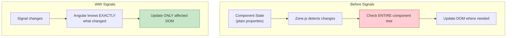
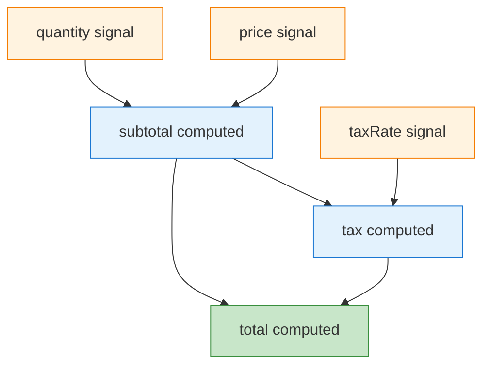

# Signals

[&larr; Control Flow](04-control-flow.md) | [Next: Directives & Pipes &rarr;](06-directives-and-pipes.md)

---

Signals are Angular's reactive primitive for managing state. They hold a value and notify consumers when it changes, enabling fine-grained reactivity without RxJS complexity.

## Table of Contents

- [Why Signals?](#why-signals)
- [Creating Signals](#creating-signals)
- [Computed Signals](#computed-signals)
- [Effects](#effects)
- [Signal-Based Component APIs](#signal-based-component-apis)
- [Advanced Signals](#advanced-signals)
- [Signals vs RxJS](#signals-vs-rxjs)
- [Key Takeaways](#key-takeaways)

---

## Why Signals?



Signals give Angular a **fine-grained reactivity model**:

- **Synchronous** — no async complexity
- **Glitch-free** — computed values are always consistent
- **Trackable** — Angular knows which template expressions depend on which signals
- **Simple API** — read with `()`, write with `set()` / `update()`

---

## Creating Signals

### Writable Signals

```typescript
import { signal } from '@angular/core';

// Create a signal with an initial value
const count = signal(0);

// Read the value (call it like a function)
console.log(count());  // 0

// Set a new value
count.set(5);
console.log(count());  // 5

// Update based on the current value
count.update(current => current + 1);
console.log(count());  // 6
```

### In a Component

```typescript
import { Component, signal } from '@angular/core';

@Component({
  selector: 'app-counter',
  template: `
    <p>Count: {{ count() }}</p>
    <button (click)="increment()">+1</button>
    <button (click)="reset()">Reset</button>
  `
})
export class CounterComponent {
  count = signal(0);

  increment() {
    this.count.update(n => n + 1);
  }

  reset() {
    this.count.set(0);
  }
}
```

> **Key:** In templates, read signals with `()` — e.g., `{{ count() }}`. This is what allows Angular to track dependencies.

### Signals with Objects and Arrays

```typescript
interface User {
  name: string;
  email: string;
}

const user = signal<User>({ name: 'Ada', email: 'ada@example.com' });

// Replace the entire object
user.set({ name: 'Grace', email: 'grace@example.com' });

// Update a property (create a new object)
user.update(current => ({ ...current, name: 'Updated' }));
```

> **Important:** Signals use reference equality by default. Always create a new object/array when updating — don't mutate in place.

---

## Computed Signals

Derived values that automatically update when their dependencies change:

```typescript
import { signal, computed } from '@angular/core';

const price = signal(100);
const quantity = signal(3);
const taxRate = signal(0.2);

// Automatically recalculates when price, quantity, or taxRate changes
const subtotal = computed(() => price() * quantity());
const tax = computed(() => subtotal() * taxRate());
const total = computed(() => subtotal() + tax());

console.log(total());  // 360

price.set(200);
console.log(total());  // 720 (automatically updated)
```

### Dependency Graph



### Properties of Computed Signals

- **Read-only** — you cannot `set()` or `update()` a computed signal
- **Lazy** — only recalculates when read after a dependency changes
- **Memoized** — caches the result until a dependency changes
- **Glitch-free** — you'll never read an inconsistent intermediate state

```typescript
const firstName = signal('Ada');
const lastName = signal('Lovelace');
const fullName = computed(() => `${firstName()} ${lastName()}`);

// In a component template:
// {{ fullName() }}  → "Ada Lovelace"
```

---

## Effects

Side effects that run when signals they read change:

```typescript
import { signal, effect } from '@angular/core';

const searchTerm = signal('');

// Runs whenever searchTerm changes
effect(() => {
  console.log(`Searching for: ${searchTerm()}`);
});

searchTerm.set('angular');  // logs: "Searching for: angular"
```

### When to Use Effects

| Use Case | Example |
|----------|---------|
| Logging | Log state changes for debugging |
| Local storage | Sync state to `localStorage` |
| DOM manipulation | Focus an input, scroll to an element |
| Third-party libraries | Update a chart library when data changes |

### When NOT to Use Effects

| Instead of... | Use... |
|---------------|--------|
| Deriving values | `computed()` |
| Updating other signals | `computed()` or update directly |
| HTTP requests | [httpResource()](10-http-client.md) or RxJS |

```typescript
// ❌ BAD: Don't use effects to derive state
effect(() => {
  this.fullName.set(`${this.firstName()} ${this.lastName()}`);
});

// ✅ GOOD: Use computed instead
fullName = computed(() => `${this.firstName()} ${this.lastName()}`);
```

### Effect Cleanup

Effects can return a cleanup function:

```typescript
effect((onCleanup) => {
  const id = setInterval(() => {
    console.log('Current count:', count());
  }, 1000);

  onCleanup(() => clearInterval(id));
});
```

### Effect Options

```typescript
// Run effect without tracking (won't register as a dependency)
import { untracked } from '@angular/core';

effect(() => {
  const search = searchTerm();  // tracked
  const count = untracked(() => resultCount());  // not tracked
  console.log(`Searched "${search}", found ${count} results`);
});
```

---

## Signal-Based Component APIs

Angular's component APIs now return signals, creating a consistent reactive model:

### `input()` — Signal-Based Inputs

```typescript
import { Component, input, computed } from '@angular/core';

@Component({
  selector: 'app-greeting',
  template: `<h1>{{ greeting() }}</h1>`
})
export class GreetingComponent {
  name = input.required<string>();
  greeting = computed(() => `Hello, ${this.name()}!`);
}
```

### `output()` — Type-Safe Outputs

```typescript
import { Component, output } from '@angular/core';

@Component({
  selector: 'app-search',
  template: `
    <input (input)="onSearch($event)" />
  `
})
export class SearchComponent {
  searched = output<string>();

  onSearch(event: Event) {
    const value = (event.target as HTMLInputElement).value;
    this.searched.emit(value);
  }
}
```

### `model()` — Two-Way Binding Signal

```typescript
import { Component, model } from '@angular/core';

@Component({
  selector: 'app-rating',
  template: `
    @for (star of stars; track star) {
      <span 
        (click)="value.set(star)" 
        [class.filled]="star <= value()">
        ★
      </span>
    }
  `
})
export class RatingComponent {
  value = model(0);
  stars = [1, 2, 3, 4, 5];
}
```

```html
<!-- Parent: two-way binding with banana-in-a-box -->
<app-rating [(value)]="userRating" />
```

### `viewChild()` / `contentChild()` — Signal-Based Queries

```typescript
import { Component, viewChild, ElementRef } from '@angular/core';

@Component({
  selector: 'app-form',
  template: `<input #emailInput type="email" />`
})
export class FormComponent {
  emailInput = viewChild<ElementRef>('emailInput');
}
```

> All signal-based APIs are covered in [Components](02-components.md). The key insight is that `input()`, `model()`, `viewChild()` etc. all return signals, so you use `computed()` and `effect()` to react to their changes.

---

## Advanced Signals

### `linkedSignal()` — Writable Signal Linked to a Source

A writable signal that resets when a source signal changes:

```typescript
import { signal, linkedSignal } from '@angular/core';

const options = signal(['Option A', 'Option B', 'Option C']);

// Resets to first option whenever options change
const selected = linkedSignal(() => options()[0]);

console.log(selected());  // 'Option A'

// User can manually change it
selected.set('Option B');
console.log(selected());  // 'Option B'

// When source changes, it resets
options.set(['X', 'Y', 'Z']);
console.log(selected());  // 'X' (reset to first)
```

**Use case:** A dropdown that resets to a default when the available options change.

### `resource()` — Async Data as a Signal

Load async data based on signal dependencies:

```typescript
import { signal, resource } from '@angular/core';

const userId = signal(1);

const userResource = resource({
  request: () => ({ id: userId() }),
  loader: async ({ request }) => {
    const response = await fetch(`/api/users/${request.id}`);
    return response.json();
  }
});

// In template:
// userResource.value()   → the loaded data (or undefined)
// userResource.status()  → 'idle' | 'loading' | 'resolved' | 'error'
// userResource.error()   → error if failed
```

See also [`httpResource()`](10-http-client.md) for a built-in HTTP-specific version.

### `toSignal()` and `toObservable()` — RxJS Interop

Bridge between signals and RxJS:

```typescript
import { toSignal, toObservable } from '@angular/core/rxjs-interop';
import { interval } from 'rxjs';

// Observable → Signal
const counter = toSignal(interval(1000), { initialValue: 0 });
// Use counter() in templates like any signal

// Signal → Observable
const searchTerm = signal('');
const searchTerm$ = toObservable(searchTerm);
// Use searchTerm$ with RxJS operators
```

> Deep dive into when to use signals vs RxJS in [Signals vs RxJS](signals-vs-rxjs.md).

---

## Signals vs RxJS

A quick comparison (full guide: [Signals vs RxJS](signals-vs-rxjs.md)):

| | Signals | RxJS Observables |
|---|---------|-----------------|
| **Model** | Pull (read when needed) | Push (emit over time) |
| **Sync/Async** | Synchronous | Both |
| **Always has value** | Yes | No (may not have emitted) |
| **Learning curve** | Low | High |
| **Best for** | UI state, derived values | Async streams, event composition |

**Rule of thumb:**
- Use **signals** for component state and simple shared state
- Use **RxJS** for HTTP streams, WebSockets, complex async workflows
- Use **`toSignal()`/`toObservable()`** to bridge the two

---

## Key Takeaways

- `signal(value)` — writable reactive value, read with `()`, write with `set()`/`update()`
- `computed(() => ...)` — derived read-only signal, auto-updates
- `effect(() => ...)` — side effects when signals change (use sparingly)
- Component APIs (`input()`, `output()`, `model()`, `viewChild()`) all return signals
- `linkedSignal()` — writable signal that resets when a source changes
- `resource()` — load async data reactively
- `toSignal()`/`toObservable()` — bridge between signals and RxJS
- Prefer `computed()` over `effect()` for derived state

---

## Free Resources

> **Official:** [Signals Guide](https://angular.dev/guide/signals) — the canonical signals reference
>
> **Official:** [linkedSignal](https://angular.dev/guide/signals/linked-signal) | [resource](https://angular.dev/guide/signals/resource) — advanced signal APIs
>
> **YouTube:** [Angular Signals — Complete Guide](https://www.youtube.com/@JoshuaMorony) — Joshua Morony's most-watched signals tutorial, covering `signal()`, `computed()`, `effect()`, and reactive patterns
>
> **YouTube:** [Angular Signals: What, Why, and How](https://www.youtube.com/@debaborahkurata) — Deborah Kurata's methodical walkthrough with practical data-fetching examples
>
> **Deep Dive:** [Signals RFC Discussion](https://github.com/angular/angular/discussions/49685) — the original design discussion explaining *why* signals were designed this way

---

**Related:**
- [Components](02-components.md) — signal-based inputs, outputs, and queries
- [Signals vs RxJS](signals-vs-rxjs.md) — detailed comparison and decision guide
- [State Management](12-state-management.md) — signals in services and NgRx SignalStore
- [Change Detection](13-change-detection.md) — how signals enable zoneless Angular

---

[&larr; Control Flow](04-control-flow.md) | [Next: Directives & Pipes &rarr;](06-directives-and-pipes.md)
