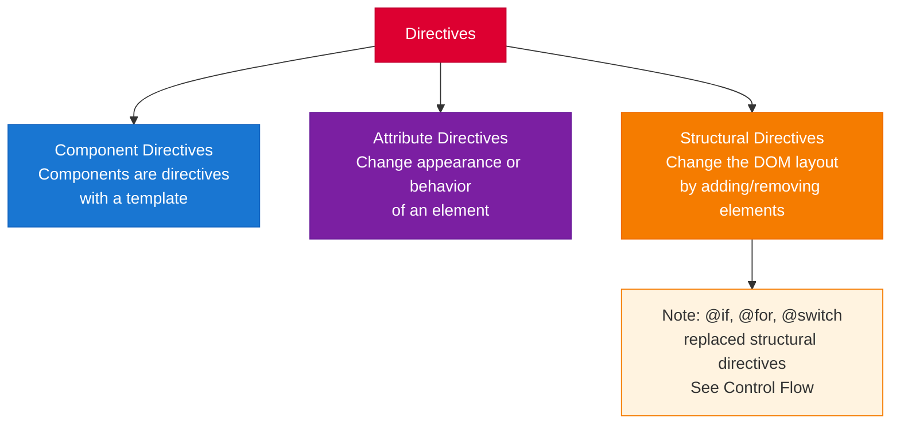

# Directives & Pipes

[&larr; Signals](05-signals.md) | [Next: Services & DI &rarr;](07-services-and-di.md)

---

Directives add behavior to DOM elements. Pipes transform data for display. Together, they keep templates clean and components focused on logic.

## Table of Contents

- [Directives Overview](#directives-overview)
- [Attribute Directives](#attribute-directives)
- [Custom Directives](#custom-directives)
- [Pipes Overview](#pipes-overview)
- [Built-in Pipes](#built-in-pipes)
- [Custom Pipes](#custom-pipes)
- [Key Takeaways](#key-takeaways)

---

## Directives Overview



> **Note:** The new [Control Flow](04-control-flow.md) blocks (`@if`, `@for`, `@switch`) replaced structural directives like `*ngIf` and `*ngFor`. You'll still encounter them in existing codebases.

---

## Attribute Directives

### `ngClass` — Dynamic Classes

```typescript
import { Component } from '@angular/core';
import { NgClass } from '@angular/common';

@Component({
  selector: 'app-status',
  imports: [NgClass],
  template: `
    <!-- Object syntax: keys are class names, values are conditions -->
    <div [ngClass]="{ 'active': isActive, 'disabled': isDisabled, 'highlight': isSpecial }">
      Status indicator
    </div>

    <!-- Array syntax -->
    <div [ngClass]="['card', isLarge ? 'card-lg' : 'card-sm']">Content</div>
  `
})
export class StatusComponent {
  isActive = true;
  isDisabled = false;
  isSpecial = true;
}
```

> **Tip:** For a single class, prefer `[class.active]="isActive"` — it's simpler. Use `ngClass` when managing multiple classes with logic. See [Templates & Binding](03-templates-and-binding.md#attribute-class-and-style-binding).

### `ngStyle` — Dynamic Styles

```typescript
import { NgStyle } from '@angular/common';

@Component({
  imports: [NgStyle],
  template: `
    <div [ngStyle]="{
      'background-color': bgColor,
      'font-size.px': fontSize,
      'font-weight': isBold ? 'bold' : 'normal'
    }">
      Styled content
    </div>
  `
})
```

> **Tip:** For a single style, prefer `[style.color]="color"`. Use `ngStyle` for multiple dynamic styles.

---

## Custom Directives

Create your own attribute directives to encapsulate reusable behavior.

### Basic Custom Directive

```bash
ng generate directive highlight
```

```typescript
import { Directive, ElementRef, HostListener, input } from '@angular/core';

@Directive({
  selector: '[appHighlight]'
})
export class HighlightDirective {
  appHighlight = input('yellow');  // default highlight color

  constructor(private el: ElementRef) {}

  @HostListener('mouseenter')
  onMouseEnter() {
    this.setColor(this.appHighlight());
  }

  @HostListener('mouseleave')
  onMouseLeave() {
    this.setColor('');
  }

  private setColor(color: string) {
    this.el.nativeElement.style.backgroundColor = color;
  }
}
```

```html
<!-- Usage (import HighlightDirective in the component's imports) -->
<p appHighlight>Highlights yellow on hover</p>
<p [appHighlight]="'lightblue'">Highlights blue on hover</p>
```

### Directive with `inject()`

The modern approach uses `inject()` instead of constructor injection:

```typescript
import { Directive, ElementRef, HostListener, inject, input } from '@angular/core';

@Directive({
  selector: '[appTooltip]'
})
export class TooltipDirective {
  appTooltip = input.required<string>();
  
  private el = inject(ElementRef);

  @HostListener('mouseenter')
  show() {
    this.el.nativeElement.title = this.appTooltip();
  }
}
```

### Host Binding

You can bind to host element properties directly:

```typescript
import { Directive, HostBinding, HostListener } from '@angular/core';

@Directive({
  selector: '[appClickTracker]',
  host: {
    '[class.clicked]': 'wasClicked',
    '(click)': 'onClick()'
  }
})
export class ClickTrackerDirective {
  wasClicked = false;

  onClick() {
    this.wasClicked = true;
  }
}
```

---

## Pipes Overview

Pipes transform data for display in templates without modifying the underlying data.

```
{{ value | pipeName }}
{{ value | pipeName:arg1:arg2 }}
{{ value | pipe1 | pipe2 }}    <!-- chaining -->
```

---

## Built-in Pipes

### Text Pipes

```html
{{ 'Hello World' | uppercase }}     <!-- HELLO WORLD -->
{{ 'Hello World' | lowercase }}     <!-- hello world -->
{{ 'hello world' | titlecase }}     <!-- Hello World -->
```

### Number Pipes

```html
{{ 3.14159 | number:'1.2-2' }}     <!-- 3.14 -->
{{ 0.85 | percent }}                <!-- 85% -->
{{ 99.99 | currency }}              <!-- $99.99 -->
{{ 99.99 | currency:'GBP' }}        <!-- £99.99 -->
{{ 99.99 | currency:'EUR':'symbol':'1.0-0' }}  <!-- €100 -->
```

The number format string `'1.2-2'` means: at least 1 integer digit, minimum 2 and maximum 2 decimal digits.

### Date Pipe

```html
{{ today | date }}                  <!-- Jun 15, 2025 -->
{{ today | date:'short' }}          <!-- 6/15/25, 9:30 AM -->
{{ today | date:'fullDate' }}       <!-- Sunday, June 15, 2025 -->
{{ today | date:'yyyy-MM-dd' }}     <!-- 2025-06-15 -->
{{ today | date:'HH:mm' }}         <!-- 09:30 -->
```

### Utility Pipes

```html
<!-- JSON (great for debugging) -->
<pre>{{ user | json }}</pre>

<!-- Slice (subset of array or string) -->
{{ 'Angular' | slice:0:3 }}         <!-- Ang -->
@for (item of items | slice:0:5; track item.id) { ... }

<!-- KeyValue (iterate object properties) -->
@for (entry of config | keyvalue; track entry.key) {
  <p>{{ entry.key }}: {{ entry.value }}</p>
}
```

### Async Pipe

Subscribes to an Observable or Promise and returns the latest emitted value. Automatically unsubscribes when the component is destroyed.

```typescript
import { Component } from '@angular/core';
import { AsyncPipe } from '@angular/common';
import { Observable, interval, map } from 'rxjs';

@Component({
  selector: 'app-timer',
  imports: [AsyncPipe],
  template: `<p>Seconds: {{ seconds$ | async }}</p>`
})
export class TimerComponent {
  seconds$: Observable<number> = interval(1000);
}
```

> **Note:** With [Signals](05-signals.md), you often don't need `AsyncPipe`. Use `toSignal()` to convert an Observable to a signal, then read it with `()` in the template. See [Signals vs RxJS](signals-vs-rxjs.md).

### Quick Reference

| Pipe | Purpose | Example |
|------|---------|---------|
| `date` | Format dates | `{{ d \| date:'short' }}` |
| `currency` | Format currency | `{{ n \| currency:'USD' }}` |
| `number` | Format numbers | `{{ n \| number:'1.0-2' }}` |
| `percent` | Format percentages | `{{ n \| percent }}` |
| `uppercase` | UPPER CASE | `{{ s \| uppercase }}` |
| `lowercase` | lower case | `{{ s \| lowercase }}` |
| `titlecase` | Title Case | `{{ s \| titlecase }}` |
| `json` | JSON stringify | `{{ obj \| json }}` |
| `slice` | Array/string subset | `{{ arr \| slice:0:5 }}` |
| `keyvalue` | Object to entries | `{{ obj \| keyvalue }}` |
| `async` | Unwrap Observable/Promise | `{{ obs$ \| async }}` |

---

## Custom Pipes

Create your own pipes for reusable data transformation.

### Basic Custom Pipe

```bash
ng generate pipe truncate
```

```typescript
import { Pipe, PipeTransform } from '@angular/core';

@Pipe({
  name: 'truncate'
})
export class TruncatePipe implements PipeTransform {
  transform(value: string, maxLength: number = 50, suffix: string = '...'): string {
    if (value.length <= maxLength) return value;
    return value.substring(0, maxLength) + suffix;
  }
}
```

```html
<!-- Import TruncatePipe in your component's imports array -->
<p>{{ article.body | truncate:100 }}</p>
<p>{{ article.body | truncate:200:'…' }}</p>
```

### Time Ago Pipe

```typescript
@Pipe({
  name: 'timeAgo'
})
export class TimeAgoPipe implements PipeTransform {
  transform(value: Date | string): string {
    const date = new Date(value);
    const seconds = Math.floor((Date.now() - date.getTime()) / 1000);

    if (seconds < 60) return 'just now';
    if (seconds < 3600) return `${Math.floor(seconds / 60)}m ago`;
    if (seconds < 86400) return `${Math.floor(seconds / 3600)}h ago`;
    return `${Math.floor(seconds / 86400)}d ago`;
  }
}
```

```html
<span>{{ post.createdAt | timeAgo }}</span>  <!-- "5m ago" -->
```

### Pure vs Impure Pipes

By default, pipes are **pure** — Angular only re-executes them when the input reference changes.

```typescript
// Pure (default) — only runs when the input reference changes
@Pipe({ name: 'filter' })
export class FilterPipe implements PipeTransform {
  transform(items: Item[], searchTerm: string): Item[] {
    return items.filter(item => item.name.includes(searchTerm));
  }
}

// Impure — runs on EVERY change detection cycle (use sparingly!)
@Pipe({ name: 'filter', pure: false })
export class FilterPipe implements PipeTransform { ... }
```

> **Performance warning:** Impure pipes run frequently. Prefer pure pipes or move filtering logic to a `computed()` signal. See [Performance](16-performance.md).

---

## Key Takeaways

- **Attribute directives** modify element appearance/behavior (`ngClass`, `ngStyle`, custom)
- **Custom directives** encapsulate reusable DOM behaviors with `@Directive`
- **Pipes** transform data for display: `{{ value | pipeName:arg }}`
- **Built-in pipes** cover dates, numbers, currency, text case, JSON, and async
- **Custom pipes** are simple classes implementing `PipeTransform`
- Prefer **pure pipes** (default) for performance — impure pipes run on every cycle
- With signals, consider `computed()` as an alternative to some pipe use cases

---

## Free Resources

> **Official:** [Directives Guide](https://angular.dev/guide/directives) | [Pipes Guide](https://angular.dev/guide/pipes) — the full reference for both
>
> **YouTube:** [Angular Directives Explained](https://www.youtube.com/@DecodedFrontend) — Decoded Frontend covers attribute directives, structural directives, and the modern host directives feature
>
> **YouTube:** [Angular Pipes — Everything You Need to Know](https://www.youtube.com/@DecodedFrontend) — built-in pipes, custom pipes, and pure vs impure

---

**Related:**
- [Templates & Data Binding](03-templates-and-binding.md) — binding syntax for directives
- [Control Flow](04-control-flow.md) — replaced structural directives
- [Signals](05-signals.md) — `computed()` as an alternative to some pipes
- [Performance](16-performance.md) — pipe purity and change detection

---

[&larr; Signals](05-signals.md) | [Next: Services & DI &rarr;](07-services-and-di.md)
