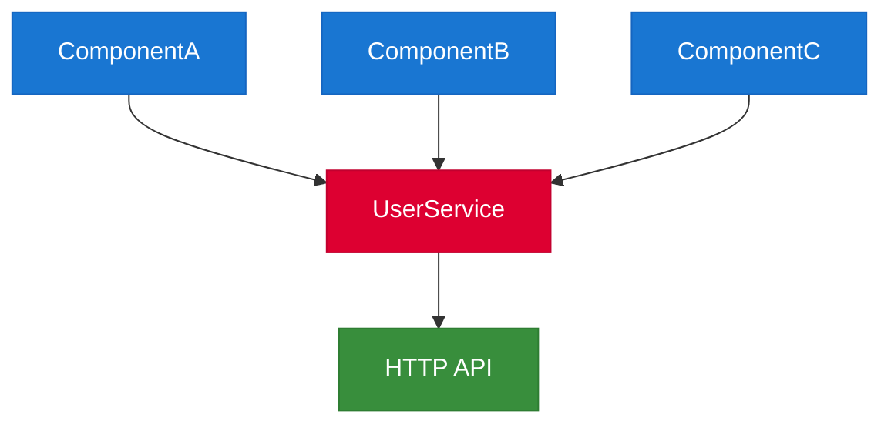
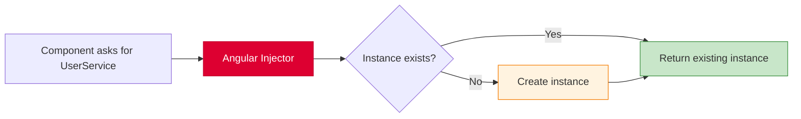
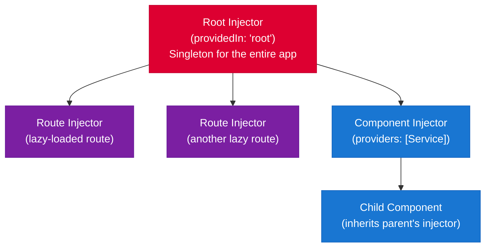

# Services & Dependency Injection

[&larr; Directives & Pipes](06-directives-and-pipes.md) | [Next: Routing &rarr;](08-routing.md)

---

Services contain reusable business logic and data. Dependency Injection (DI) is how Angular delivers services to the components that need them.

## Table of Contents

- [What Is a Service?](#what-is-a-service)
- [Creating Services](#creating-services)
- [Dependency Injection](#dependency-injection)
- [Injection Scopes](#injection-scopes)
- [The inject() Function](#the-inject-function)
- [Injection Tokens](#injection-tokens)
- [Key Takeaways](#key-takeaways)

---

## What Is a Service?

A service is any class that provides functionality you want to share across components. Common uses:

- **Data services** — fetch and manage data from APIs
- **State services** — share state between components (see [State Management](12-state-management.md))
- **Utility services** — logging, error handling, configuration
- **Business logic** — validation, calculation, transformation



> **Why not put logic in components?** Components should focus on presenting data. Services keep business logic testable, reusable, and independent of the UI.

---

## Creating Services

```bash
ng generate service user
# Shorthand: ng g s user
```

```typescript
// user.service.ts
import { Injectable, signal, computed } from '@angular/core';

export interface User {
  id: number;
  name: string;
  email: string;
}

@Injectable({
  providedIn: 'root'  // available application-wide as a singleton
})
export class UserService {
  private users = signal<User[]>([]);
  
  allUsers = this.users.asReadonly();
  userCount = computed(() => this.users().length);

  addUser(user: User) {
    this.users.update(current => [...current, user]);
  }

  removeUser(id: number) {
    this.users.update(current => current.filter(u => u.id !== id));
  }

  getUserById(id: number) {
    return this.users().find(u => u.id === id);
  }
}
```

### Using a Service in a Component

```typescript
import { Component, inject } from '@angular/core';
import { UserService } from './user.service';

@Component({
  selector: 'app-user-list',
  template: `
    <h2>Users ({{ userService.userCount() }})</h2>
    @for (user of userService.allUsers(); track user.id) {
      <p>{{ user.name }} — {{ user.email }}</p>
    } @empty {
      <p>No users yet.</p>
    }
  `
})
export class UserListComponent {
  userService = inject(UserService);
}
```

---

## Dependency Injection

DI is a design pattern where a class receives its dependencies from an external source rather than creating them itself.

### How It Works



1. A component declares it needs a service (via `inject()` or constructor parameter)
2. Angular's injector looks up the service
3. If an instance exists in scope, it returns it
4. If not, it creates one, stores it, and returns it

### The Injector Hierarchy

Angular has a tree of injectors that mirrors the component tree:



When a component requests a service, Angular walks **up** the injector tree until it finds a provider.

---

## Injection Scopes

### Application-Wide Singleton (Most Common)

```typescript
@Injectable({
  providedIn: 'root'  // one instance shared by the entire app
})
export class AuthService { }
```

### Component-Level Instance

Each component gets its own instance:

```typescript
@Component({
  selector: 'app-editor',
  providers: [EditorStateService],  // new instance per component
  template: `...`
})
export class EditorComponent {
  state = inject(EditorStateService);
}
```

### Route-Level Instance

Services scoped to a lazy-loaded route:

```typescript
// In route configuration
{
  path: 'admin',
  loadComponent: () => import('./admin.component'),
  providers: [AdminService]  // scoped to this route and its children
}
```

### When to Use Which Scope

| Scope | Use When |
|-------|----------|
| `providedIn: 'root'` | Shared state, auth, HTTP, logging |
| Component `providers` | Each component instance needs its own state |
| Route `providers` | State scoped to a feature area |

---

## The `inject()` Function

The modern way to inject dependencies. Preferred over constructor injection.

### Basic Usage

```typescript
import { Component, inject } from '@angular/core';
import { UserService } from './user.service';
import { Router } from '@angular/router';

@Component({ ... })
export class DashboardComponent {
  private userService = inject(UserService);
  private router = inject(Router);
}
```

### vs Constructor Injection (Legacy)

```typescript
// ✅ Modern: inject() function
export class DashboardComponent {
  private userService = inject(UserService);
}

// ❌ Legacy: constructor injection (still works, but less preferred)
export class DashboardComponent {
  constructor(private userService: UserService) {}
}
```

**Why `inject()` is preferred:**
- Works in any injection context (not just constructors)
- Easier to refactor and test
- No need for parameter decorators
- Works with functional guards, interceptors, and resolvers

### Injection Context

`inject()` only works during construction (field initializers, constructors) or in specific Angular contexts:

```typescript
// ✅ Works — field initializer
export class MyComponent {
  private service = inject(MyService);
}

// ✅ Works — constructor
export class MyComponent {
  constructor() {
    const service = inject(MyService);
  }
}

// ❌ DOES NOT WORK — called later
export class MyComponent {
  onClick() {
    const service = inject(MyService);  // Error!
  }
}
```

---

## Injection Tokens

For injecting values that aren't classes (configuration, feature flags, etc.):

```typescript
import { InjectionToken, inject } from '@angular/core';

// Define a token
export const API_BASE_URL = new InjectionToken<string>('API_BASE_URL');
export const FEATURE_FLAGS = new InjectionToken<Record<string, boolean>>('FEATURE_FLAGS');
```

```typescript
// Provide the value (in app.config.ts or component providers)
export const appConfig: ApplicationConfig = {
  providers: [
    { provide: API_BASE_URL, useValue: 'https://api.example.com' },
    { provide: FEATURE_FLAGS, useValue: { darkMode: true, beta: false } }
  ]
};
```

```typescript
// Inject the value
export class ApiService {
  private baseUrl = inject(API_BASE_URL);
  private flags = inject(FEATURE_FLAGS);
}
```

### Provider Types

| Provider | Syntax | Use Case |
|----------|--------|----------|
| `useValue` | `{ provide: TOKEN, useValue: 'value' }` | Static values, config |
| `useClass` | `{ provide: Service, useClass: MockService }` | Swap implementations |
| `useFactory` | `{ provide: TOKEN, useFactory: () => ... }` | Dynamic creation |
| `useExisting` | `{ provide: Old, useExisting: New }` | Alias to another provider |

### Factory Provider Example

```typescript
export const appConfig: ApplicationConfig = {
  providers: [
    {
      provide: API_BASE_URL,
      useFactory: () => {
        const isProd = inject(ENVIRONMENT).production;
        return isProd ? 'https://api.example.com' : 'http://localhost:3000';
      }
    }
  ]
};
```

---

## Practical Example: Auth Service

A complete service demonstrating common patterns:

```typescript
import { Injectable, signal, computed, inject } from '@angular/core';
import { HttpClient } from '@angular/common/http';
import { Router } from '@angular/router';

interface AuthState {
  user: User | null;
  token: string | null;
}

@Injectable({ providedIn: 'root' })
export class AuthService {
  private http = inject(HttpClient);
  private router = inject(Router);

  private state = signal<AuthState>({ user: null, token: null });

  currentUser = computed(() => this.state().user);
  isLoggedIn = computed(() => this.state().user !== null);
  token = computed(() => this.state().token);

  async login(email: string, password: string): Promise<boolean> {
    try {
      const response = await fetch('/api/auth/login', {
        method: 'POST',
        body: JSON.stringify({ email, password }),
        headers: { 'Content-Type': 'application/json' }
      });
      const data = await response.json();
      this.state.set({ user: data.user, token: data.token });
      return true;
    } catch {
      return false;
    }
  }

  logout() {
    this.state.set({ user: null, token: null });
    this.router.navigate(['/login']);
  }
}
```

---

## Key Takeaways

- **Services** hold reusable logic and shared state — keep components lean
- `@Injectable({ providedIn: 'root' })` creates an app-wide singleton
- **`inject()`** is the modern way to request dependencies (preferred over constructor injection)
- The **injector hierarchy** determines scope: root → route → component
- Use **`InjectionToken`** for non-class dependencies (config, flags)
- Component `providers` create new instances per component — useful for component-scoped state

---

## Free Resources

> **Official:** [Dependency Injection Guide](https://angular.dev/guide/di) — one of the best-written sections in the official docs
>
> **YouTube:** [Angular Dependency Injection — Understanding the Fundamentals](https://www.youtube.com/@DecodedFrontend) — Decoded Frontend's excellent DI explainer covering `providedIn`, tokens, multi-providers, and the injector hierarchy
>
> **YouTube:** [Angular inject() Function — Why You Should Use It](https://www.youtube.com/@JoshuaMorony) — Joshua Morony on the modern `inject()` function replacing constructor injection

---

**Related:**
- [State Management](12-state-management.md) — scaling state with signals in services
- [HTTP Client](10-http-client.md) — using services for API calls
- [Routing](08-routing.md) — route-level providers and guards
- [Testing](14-testing.md) — mocking services in tests

---

[&larr; Directives & Pipes](06-directives-and-pipes.md) | [Next: Routing &rarr;](08-routing.md)
