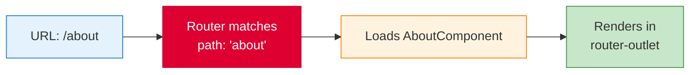
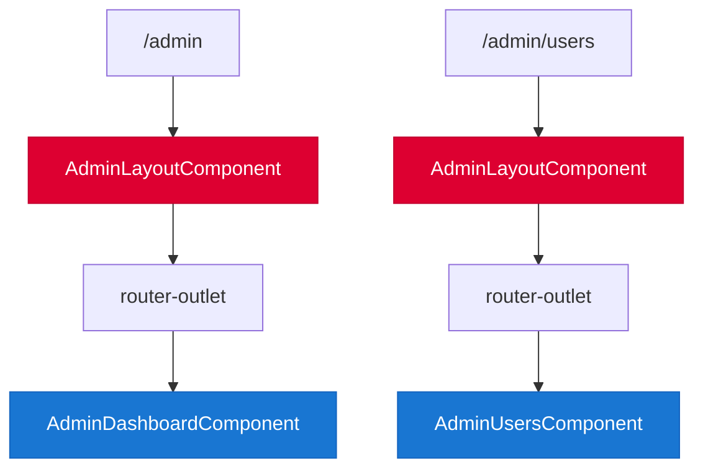
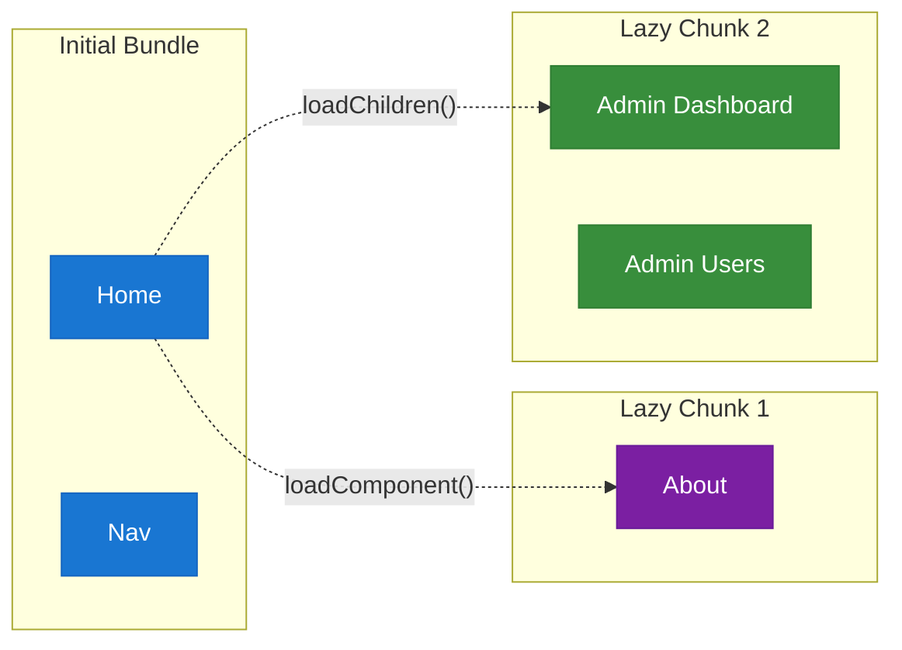

# Routing

[&larr; Services & DI](07-services-and-di.md) | [Next: Forms &rarr;](09-forms.md)

---

Routing enables navigation between views in a single-page application. Angular's router maps URL paths to components, supports lazy loading, guards, and nested layouts.

## Table of Contents

- [Basic Setup](#basic-setup)
- [Defining Routes](#defining-routes)
- [Navigation](#navigation)
- [Route Parameters](#route-parameters)
- [Nested Routes](#nested-routes)
- [Lazy Loading](#lazy-loading)
- [Route Guards](#route-guards)
- [Resolvers](#resolvers)
- [Key Takeaways](#key-takeaways)

---

## Basic Setup

### 1. Provide the Router

In `app.config.ts`:

```typescript
import { provideRouter } from '@angular/router';
import { routes } from './app.routes';

export const appConfig: ApplicationConfig = {
  providers: [
    provideRouter(routes)
  ]
};
```

### 2. Define Routes

In `app.routes.ts`:

```typescript
import { Routes } from '@angular/router';
import { HomeComponent } from './home.component';
import { AboutComponent } from './about.component';

export const routes: Routes = [
  { path: '', component: HomeComponent },
  { path: 'about', component: AboutComponent },
  { path: '**', redirectTo: '' }  // catch-all redirect
];
```

### 3. Add the Router Outlet

In `app.component.html`:

```html
<nav>
  <a routerLink="/" routerLinkActive="active" [routerLinkActiveOptions]="{ exact: true }">Home</a>
  <a routerLink="/about" routerLinkActive="active">About</a>
</nav>

<router-outlet />  <!-- matched component renders here -->
```

```typescript
// app.component.ts
import { Component } from '@angular/core';
import { RouterOutlet, RouterLink, RouterLinkActive } from '@angular/router';

@Component({
  selector: 'app-root',
  imports: [RouterOutlet, RouterLink, RouterLinkActive],
  templateUrl: './app.component.html'
})
export class AppComponent {}
```

### How It Works



---

## Defining Routes

### Static Routes

```typescript
export const routes: Routes = [
  { path: '', component: HomeComponent },
  { path: 'products', component: ProductListComponent },
  { path: 'contact', component: ContactComponent },
];
```

### Redirects

```typescript
{ path: 'home', redirectTo: '', pathMatch: 'full' },
{ path: '**', redirectTo: '' }  // wildcard — catch all unmatched URLs
```

> `pathMatch: 'full'` means the entire URL must match. Without it, `''` matches *every* URL.

### Title

```typescript
{ path: 'about', component: AboutComponent, title: 'About Us' }
```

Angular automatically sets `document.title` when navigating to this route.

---

## Navigation

### Template Navigation with `routerLink`

```html
<!-- Static link -->
<a routerLink="/products">Products</a>

<!-- Dynamic link -->
<a [routerLink]="['/products', product.id]">{{ product.name }}</a>

<!-- With query parameters -->
<a [routerLink]="['/products']" [queryParams]="{ category: 'electronics' }">
  Electronics
</a>

<!-- Highlight active link -->
<a routerLink="/about" routerLinkActive="active-link">About</a>
```

### Programmatic Navigation

```typescript
import { Component, inject } from '@angular/core';
import { Router } from '@angular/router';

@Component({ ... })
export class LoginComponent {
  private router = inject(Router);

  onLoginSuccess() {
    // Navigate to dashboard
    this.router.navigate(['/dashboard']);

    // With route parameters
    this.router.navigate(['/users', userId]);

    // With query parameters
    this.router.navigate(['/search'], { 
      queryParams: { q: 'angular', page: 1 } 
    });

    // Relative navigation
    this.router.navigate(['../sibling'], { relativeTo: this.route });
  }
}
```

---

## Route Parameters

### Path Parameters

```typescript
// Route definition
{ path: 'users/:id', component: UserDetailComponent }
```

```typescript
// Reading the parameter
import { Component, input } from '@angular/core';

@Component({
  selector: 'app-user-detail',
  template: `<h2>User {{ id() }}</h2>`
})
export class UserDetailComponent {
  // With route input binding (modern approach)
  id = input.required<string>();
}
```

> **Route input binding** requires enabling `withComponentInputBinding()`:
> ```typescript
> provideRouter(routes, withComponentInputBinding())
> ```
> This automatically binds route params, query params, and data to `input()` signals.

### Alternative: Using `ActivatedRoute`

```typescript
import { Component, inject } from '@angular/core';
import { ActivatedRoute } from '@angular/router';
import { toSignal } from '@angular/core/rxjs-interop';
import { map } from 'rxjs';

@Component({ ... })
export class UserDetailComponent {
  private route = inject(ActivatedRoute);
  
  id = toSignal(
    this.route.paramMap.pipe(map(params => params.get('id')!))
  );
}
```

### Query Parameters

```typescript
// URL: /search?q=angular&page=2
{ path: 'search', component: SearchComponent }
```

```typescript
@Component({ ... })
export class SearchComponent {
  // With route input binding
  q = input<string>('');
  page = input<number>(1);
}
```

---

## Nested Routes

### Child Routes

```typescript
export const routes: Routes = [
  {
    path: 'admin',
    component: AdminLayoutComponent,
    children: [
      { path: '', component: AdminDashboardComponent },
      { path: 'users', component: AdminUsersComponent },
      { path: 'settings', component: AdminSettingsComponent }
    ]
  }
];
```

```html
<!-- admin-layout.component.html -->
<nav>
  <a routerLink="users">Users</a>
  <a routerLink="settings">Settings</a>
</nav>

<router-outlet />  <!-- child routes render here -->
```

### Route Layout



---

## Lazy Loading

Load feature areas on demand to reduce initial bundle size:

```typescript
export const routes: Routes = [
  { path: '', component: HomeComponent },
  
  // Lazy load a single component
  {
    path: 'about',
    loadComponent: () => import('./about.component').then(m => m.AboutComponent)
  },
  
  // Lazy load an entire route subtree
  {
    path: 'admin',
    loadChildren: () => import('./admin/admin.routes').then(m => m.adminRoutes)
  }
];
```

```typescript
// admin/admin.routes.ts
export const adminRoutes: Routes = [
  { path: '', component: AdminDashboardComponent },
  { path: 'users', component: AdminUsersComponent }
];
```



> Lazy loading is one of the most impactful [Performance](16-performance.md) optimizations. See also [`@defer`](04-control-flow.md#defer--lazy-loading-blocks) for component-level lazy loading.

---

## Route Guards

Guards control access to routes. Modern Angular uses **functional guards**:

### `canActivate` — Protect a Route

```typescript
// auth.guard.ts
import { inject } from '@angular/core';
import { CanActivateFn, Router } from '@angular/router';
import { AuthService } from './auth.service';

export const authGuard: CanActivateFn = () => {
  const auth = inject(AuthService);
  const router = inject(Router);

  if (auth.isLoggedIn()) {
    return true;
  }
  return router.createUrlTree(['/login']);
};
```

```typescript
// Apply the guard
{
  path: 'dashboard',
  component: DashboardComponent,
  canActivate: [authGuard]
}
```

### `canMatch` — Conditionally Match a Route

```typescript
export const adminGuard: CanMatchFn = () => {
  return inject(AuthService).currentUser()?.role === 'admin';
};

// Different component based on role
{ path: 'home', component: AdminHomeComponent, canMatch: [adminGuard] },
{ path: 'home', component: UserHomeComponent }
```

### `canDeactivate` — Confirm Before Leaving

```typescript
export const unsavedChangesGuard: CanDeactivateFn<{ hasUnsavedChanges: () => boolean }> = 
  (component) => {
    if (component.hasUnsavedChanges()) {
      return confirm('You have unsaved changes. Leave anyway?');
    }
    return true;
  };
```

### Guard Summary

| Guard | Purpose | Returns |
|-------|---------|---------|
| `canActivate` | Can the user visit this route? | `boolean \| UrlTree` |
| `canMatch` | Should this route definition match? | `boolean` |
| `canDeactivate` | Can the user leave this route? | `boolean` |
| `canActivateChild` | Can the user visit child routes? | `boolean \| UrlTree` |

---

## Resolvers

Pre-fetch data before a route activates:

```typescript
// user.resolver.ts
import { inject } from '@angular/core';
import { ResolveFn } from '@angular/router';

export const userResolver: ResolveFn<User> = (route) => {
  const userService = inject(UserService);
  return userService.getById(route.paramMap.get('id')!);
};
```

```typescript
// Route config
{
  path: 'users/:id',
  component: UserDetailComponent,
  resolve: { user: userResolver }
}
```

```typescript
// Access resolved data via input binding
@Component({ ... })
export class UserDetailComponent {
  user = input.required<User>();
}
```

---

## Router Features

Enable additional features via `provideRouter()` helper functions:

```typescript
import { 
  provideRouter,
  withComponentInputBinding,
  withViewTransitions,
  withInMemoryScrolling
} from '@angular/router';

export const appConfig: ApplicationConfig = {
  providers: [
    provideRouter(
      routes,
      withComponentInputBinding(),          // bind route params to inputs
      withViewTransitions(),                 // smooth page transitions
      withInMemoryScrolling({               // scroll behavior
        scrollPositionRestoration: 'top',
        anchorScrolling: 'enabled'
      })
    )
  ]
};
```

---

## Key Takeaways

- Configure routing with `provideRouter(routes)` in `app.config.ts`
- Routes map URL paths to components; `<router-outlet>` renders the matched component
- Use `routerLink` in templates, `Router.navigate()` in code
- **Lazy loading** (`loadComponent`, `loadChildren`) reduces initial bundle size
- **Functional guards** (`canActivate`, `canMatch`, `canDeactivate`) control access
- **Resolvers** pre-fetch data before route activation
- Enable `withComponentInputBinding()` to bind route params directly to `input()` signals

---

## Free Resources

> **Official:** [Routing Guide](https://angular.dev/guide/routing) | [Route Guards](https://angular.dev/guide/routing/guards) — complete routing reference with functional guards
>
> **YouTube:** [Angular Router — Complete Guide](https://www.youtube.com/@DecodedFrontend) — Decoded Frontend covers route config, nested routes, lazy loading with `loadComponent`, and functional guards
>
> **YouTube:** [Angular Route Input Binding — No More ActivatedRoute!](https://www.youtube.com/@JoshuaMorony) — Joshua Morony on `withComponentInputBinding()` for binding route params directly to component inputs

---

**Related:**
- [Lazy Loading & Performance](16-performance.md) — optimizing route loading
- [Services & DI](07-services-and-di.md) — route-level providers
- [SSR & Hydration](15-ssr-and-hydration.md) — route-level render modes
- [Components](02-components.md) — the components that routes render

---

[&larr; Services & DI](07-services-and-di.md) | [Next: Forms &rarr;](09-forms.md)
