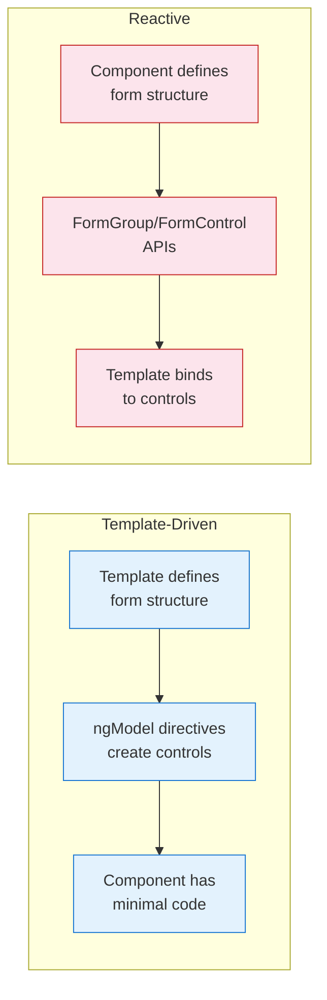
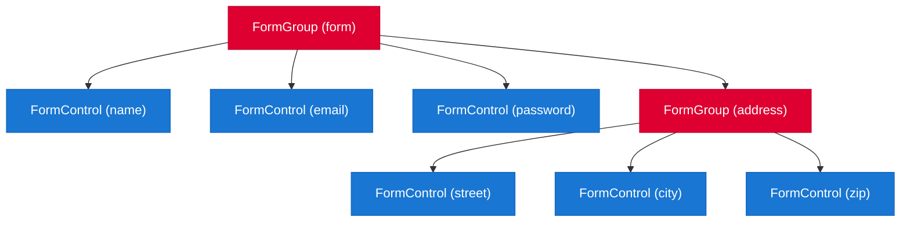

# Forms

[&larr; Routing](08-routing.md) | [Next: HTTP Client &rarr;](10-http-client.md)

---

Angular provides two approaches to forms: **template-driven** (simple, less code) and **reactive** (explicit, more control). Both support validation, error display, and form state tracking.

## Table of Contents

- [Template-Driven vs Reactive](#template-driven-vs-reactive)
- [Template-Driven Forms](#template-driven-forms)
- [Reactive Forms](#reactive-forms)
- [Validation](#validation)
- [Custom Validators](#custom-validators)
- [Dynamic Forms](#dynamic-forms)
- [Key Takeaways](#key-takeaways)

---

## Template-Driven vs Reactive



| | Template-Driven | Reactive |
|--|----------------|----------|
| **Setup** | `FormsModule` | `ReactiveFormsModule` |
| **Structure** | Defined in template | Defined in TypeScript |
| **Data model** | Two-way binding (`ngModel`) | `FormGroup` / `FormControl` |
| **Validation** | Template attributes + directives | Functions in TypeScript |
| **Best for** | Simple forms, quick prototypes | Complex forms, dynamic fields, testing |
| **Typed?** | No | Yes (strongly typed since Angular 14) |

**Recommendation:** Use **reactive forms** for most cases. They're easier to test, strongly typed, and scale better.

---

## Template-Driven Forms

### Setup

Import `FormsModule` in your component:

```typescript
import { Component } from '@angular/core';
import { FormsModule } from '@angular/forms';

@Component({
  selector: 'app-login',
  imports: [FormsModule],
  templateUrl: './login.component.html'
})
export class LoginComponent {
  email = '';
  password = '';

  onSubmit() {
    console.log('Login:', this.email, this.password);
  }
}
```

### Template

```html
<form #loginForm="ngForm" (ngSubmit)="onSubmit()">
  <div>
    <label for="email">Email</label>
    <input 
      id="email" 
      type="email"
      [(ngModel)]="email" 
      name="email"
      required 
      email
      #emailField="ngModel" />
    
    @if (emailField.invalid && emailField.touched) {
      <div class="error">
        @if (emailField.errors?.['required']) { <p>Email is required.</p> }
        @if (emailField.errors?.['email']) { <p>Invalid email format.</p> }
      </div>
    }
  </div>

  <div>
    <label for="password">Password</label>
    <input 
      id="password" 
      type="password"
      [(ngModel)]="password" 
      name="password"
      required 
      minlength="8" />
  </div>

  <button type="submit" [disabled]="loginForm.invalid">Log In</button>
</form>
```

> **Key points:** Each `ngModel` needs a `name` attribute. Use `#ref="ngModel"` to access validation state. See [Templates & Data Binding](03-templates-and-binding.md) for `[(ngModel)]` details.

---

## Reactive Forms

### Setup

```typescript
import { Component } from '@angular/core';
import { ReactiveFormsModule, FormBuilder, Validators } from '@angular/forms';

@Component({
  selector: 'app-registration',
  imports: [ReactiveFormsModule],
  templateUrl: './registration.component.html'
})
export class RegistrationComponent {
  private fb = inject(FormBuilder);

  form = this.fb.group({
    name: ['', [Validators.required, Validators.minLength(2)]],
    email: ['', [Validators.required, Validators.email]],
    password: ['', [Validators.required, Validators.minLength(8)]],
    confirmPassword: ['', Validators.required],
    address: this.fb.group({
      street: [''],
      city: [''],
      zip: ['', Validators.pattern(/^\d{5}$/)]
    })
  });

  onSubmit() {
    if (this.form.valid) {
      console.log(this.form.value);
      // { name: '...', email: '...', password: '...', ... }
    }
  }
}
```

### Template

```html
<form [formGroup]="form" (ngSubmit)="onSubmit()">
  <div>
    <label for="name">Name</label>
    <input id="name" formControlName="name" />
    @if (form.controls.name.invalid && form.controls.name.touched) {
      <div class="error">
        @if (form.controls.name.hasError('required')) { <p>Name is required.</p> }
        @if (form.controls.name.hasError('minlength')) { <p>Name must be at least 2 characters.</p> }
      </div>
    }
  </div>

  <div>
    <label for="email">Email</label>
    <input id="email" type="email" formControlName="email" />
  </div>

  <div>
    <label for="password">Password</label>
    <input id="password" type="password" formControlName="password" />
  </div>

  <!-- Nested form group -->
  <fieldset formGroupName="address">
    <legend>Address</legend>
    <input formControlName="street" placeholder="Street" />
    <input formControlName="city" placeholder="City" />
    <input formControlName="zip" placeholder="ZIP" />
  </fieldset>

  <button type="submit" [disabled]="form.invalid">Register</button>
</form>
```

### Form Structure



### Typed Forms

Reactive forms are strongly typed since Angular 14. The compiler knows the shape of `form.value`:

```typescript
// TypeScript knows this is { name: string | null, email: string | null, ... }
const values = this.form.value;

// Access with type safety
const name = this.form.controls.name.value;  // string | null

// Non-nullable form (all fields required and non-null)
const rawValues = this.form.getRawValue();
```

### Form Control States

| State | Description | Check |
|-------|-------------|-------|
| `valid` | All validations pass | `control.valid` |
| `invalid` | Has validation errors | `control.invalid` |
| `pristine` | User hasn't changed value | `control.pristine` |
| `dirty` | User has changed value | `control.dirty` |
| `touched` | User has focused then blurred | `control.touched` |
| `untouched` | User hasn't focused yet | `control.untouched` |

### Programmatic Control

```typescript
// Set value
this.form.controls.name.setValue('Ada');

// Patch partial values
this.form.patchValue({ name: 'Ada', email: 'ada@example.com' });

// Reset form
this.form.reset();

// Disable/enable
this.form.controls.email.disable();
this.form.controls.email.enable();

// Listen to value changes
this.form.controls.name.valueChanges.subscribe(value => {
  console.log('Name changed:', value);
});
```

---

## Validation

### Built-in Validators

| Validator | Template-Driven | Reactive |
|-----------|----------------|----------|
| Required | `required` | `Validators.required` |
| Min length | `minlength="3"` | `Validators.minLength(3)` |
| Max length | `maxlength="50"` | `Validators.maxLength(50)` |
| Pattern | `pattern="[a-z]+"` | `Validators.pattern(/[a-z]+/)` |
| Email | `email` | `Validators.email` |
| Min value | `min="0"` | `Validators.min(0)` |
| Max value | `max="100"` | `Validators.max(100)` |

### Display Errors

```html
@let nameCtrl = form.controls.name;

@if (nameCtrl.invalid && nameCtrl.touched) {
  <div class="errors">
    @if (nameCtrl.hasError('required')) {
      <p>Name is required.</p>
    }
    @if (nameCtrl.hasError('minlength')) {
      @let err = nameCtrl.getError('minlength');
      <p>Minimum {{ err.requiredLength }} characters (you entered {{ err.actualLength }}).</p>
    }
  </div>
}
```

### CSS Classes

Angular automatically adds CSS classes to form controls:

| State | Class | Inverse Class |
|-------|-------|---------------|
| Valid | `.ng-valid` | `.ng-invalid` |
| Touched | `.ng-touched` | `.ng-untouched` |
| Dirty | `.ng-dirty` | `.ng-pristine` |

```css
input.ng-invalid.ng-touched {
  border-color: red;
}
input.ng-valid.ng-touched {
  border-color: green;
}
```

---

## Custom Validators

### Synchronous Validator

```typescript
import { AbstractControl, ValidationErrors, ValidatorFn } from '@angular/forms';

export function forbiddenNameValidator(forbidden: string): ValidatorFn {
  return (control: AbstractControl): ValidationErrors | null => {
    const isForbidden = control.value === forbidden;
    return isForbidden ? { forbiddenName: { value: control.value } } : null;
  };
}

// Usage
this.fb.group({
  username: ['', [Validators.required, forbiddenNameValidator('admin')]]
});
```

### Async Validator

For validations that require a server call (e.g., checking if a username is taken):

```typescript
import { AsyncValidatorFn } from '@angular/forms';
import { map, debounceTime, switchMap, first } from 'rxjs';

export function uniqueEmailValidator(userService: UserService): AsyncValidatorFn {
  return (control: AbstractControl) => {
    return control.valueChanges.pipe(
      debounceTime(300),
      switchMap(email => userService.checkEmailAvailable(email)),
      map(available => available ? null : { emailTaken: true }),
      first()
    );
  };
}
```

### Cross-Field Validator

Validate fields relative to each other:

```typescript
export const passwordMatchValidator: ValidatorFn = (form: AbstractControl) => {
  const password = form.get('password')?.value;
  const confirm = form.get('confirmPassword')?.value;
  return password === confirm ? null : { passwordMismatch: true };
};

// Apply to the FormGroup
this.fb.group({
  password: ['', Validators.required],
  confirmPassword: ['', Validators.required]
}, { validators: passwordMatchValidator });
```

```html
@if (form.hasError('passwordMismatch')) {
  <p class="error">Passwords do not match.</p>
}
```

---

## Dynamic Forms

### FormArray — Dynamic Lists

```typescript
import { FormArray, FormBuilder, ReactiveFormsModule } from '@angular/forms';

@Component({
  imports: [ReactiveFormsModule],
  template: `
    <form [formGroup]="form">
      <div formArrayName="skills">
        @for (skill of skills.controls; track $index; let i = $index) {
          <div>
            <input [formControlName]="i" />
            <button (click)="removeSkill(i)">Remove</button>
          </div>
        }
      </div>
      <button (click)="addSkill()">Add Skill</button>
    </form>
  `
})
export class SkillsComponent {
  private fb = inject(FormBuilder);

  form = this.fb.group({
    skills: this.fb.array(['Angular', 'TypeScript'])
  });

  get skills() {
    return this.form.controls.skills;
  }

  addSkill() {
    this.skills.push(this.fb.control(''));
  }

  removeSkill(index: number) {
    this.skills.removeAt(index);
  }
}
```

---

## Key Takeaways

- **Template-driven:** Simple, less code, good for basic forms. Uses `FormsModule` + `ngModel`
- **Reactive:** Full control, typed, testable. Uses `ReactiveFormsModule` + `FormGroup`/`FormControl`
- **Prefer reactive forms** for anything beyond simple cases
- Built-in validators cover common cases; write custom validators for business rules
- Cross-field validators apply to `FormGroup`, not individual controls
- `FormArray` handles dynamic lists of controls
- Angular adds CSS classes (`ng-valid`, `ng-touched`, etc.) for easy styling

---

## Free Resources

> **Official:** [Forms Guide](https://angular.dev/guide/forms) | [Reactive Forms](https://angular.dev/guide/forms/reactive-forms) — template-driven and reactive forms reference
>
> **YouTube:** [Angular Reactive Forms — Complete Guide](https://www.youtube.com/@DecodedFrontend) — Decoded Frontend covers FormGroup, FormControl, FormArray, validators, and custom validators
>
> **YouTube:** [Angular Forms with Signals](https://www.youtube.com/@JoshuaMorony) — Joshua Morony explores integrating signals with forms for reactive validation patterns

---

**Related:**
- [Templates & Data Binding](03-templates-and-binding.md) — two-way binding with `ngModel`
- [Services & DI](07-services-and-di.md) — form submission typically calls a service
- [HTTP Client](10-http-client.md) — sending form data to APIs
- [RxJS](11-rxjs.md) — async validators use Observables

---

[&larr; Routing](08-routing.md) | [Next: HTTP Client &rarr;](10-http-client.md)
