# HTTP Client

[&larr; Forms](09-forms.md) | [Next: RxJS Essentials &rarr;](11-rxjs.md)

---

Angular's `HttpClient` makes API calls and returns Observables. The newer `httpResource()` integrates directly with [Signals](05-signals.md) for a simpler reactive model.

## Table of Contents

- [Setup](#setup)
- [Making Requests](#making-requests)
- [Error Handling](#error-handling)
- [Interceptors](#interceptors)
- [httpResource()](#httpresource)
- [Key Takeaways](#key-takeaways)

---

## Setup

Provide the HTTP client in `app.config.ts`:

```typescript
import { provideHttpClient, withInterceptors } from '@angular/common/http';

export const appConfig: ApplicationConfig = {
  providers: [
    provideHttpClient(
      withInterceptors([/* interceptors go here */])
    )
  ]
};
```

---

## Making Requests

### GET

```typescript
import { Injectable, inject } from '@angular/core';
import { HttpClient } from '@angular/common/http';

interface User {
  id: number;
  name: string;
  email: string;
}

@Injectable({ providedIn: 'root' })
export class UserService {
  private http = inject(HttpClient);

  getUsers() {
    return this.http.get<User[]>('/api/users');
  }

  getUserById(id: number) {
    return this.http.get<User>(`/api/users/${id}`);
  }
}
```

### POST, PUT, DELETE

```typescript
@Injectable({ providedIn: 'root' })
export class UserService {
  private http = inject(HttpClient);

  createUser(user: Omit<User, 'id'>) {
    return this.http.post<User>('/api/users', user);
  }

  updateUser(id: number, changes: Partial<User>) {
    return this.http.put<User>(`/api/users/${id}`, changes);
  }

  deleteUser(id: number) {
    return this.http.delete<void>(`/api/users/${id}`);
  }
}
```

### Using in Components

```typescript
import { Component, inject, signal } from '@angular/core';
import { UserService } from './user.service';

@Component({
  selector: 'app-user-list',
  template: `
    @if (loading()) {
      <app-spinner />
    } @else {
      @for (user of users(); track user.id) {
        <p>{{ user.name }}</p>
      } @empty {
        <p>No users found.</p>
      }
    }
  `
})
export class UserListComponent {
  private userService = inject(UserService);
  
  users = signal<User[]>([]);
  loading = signal(true);

  constructor() {
    this.userService.getUsers().subscribe({
      next: (users) => {
        this.users.set(users);
        this.loading.set(false);
      },
      error: (err) => {
        console.error('Failed to load users:', err);
        this.loading.set(false);
      }
    });
  }
}
```

### Request Options

```typescript
// Headers
this.http.get<User[]>('/api/users', {
  headers: { 'Authorization': `Bearer ${token}` }
});

// Query parameters
this.http.get<User[]>('/api/users', {
  params: { page: '1', limit: '10', sort: 'name' }
});

// Observe the full response (not just body)
this.http.get<User[]>('/api/users', { observe: 'response' })
  .subscribe(response => {
    console.log('Status:', response.status);
    console.log('Headers:', response.headers.get('X-Total-Count'));
    console.log('Body:', response.body);
  });

// Get response as text
this.http.get('/api/readme', { responseType: 'text' });

// Get response as blob (for file downloads)
this.http.get('/api/files/report.pdf', { responseType: 'blob' });
```

---

## Error Handling

### In a Service

```typescript
import { HttpErrorResponse } from '@angular/common/http';
import { catchError, throwError } from 'rxjs';

@Injectable({ providedIn: 'root' })
export class UserService {
  private http = inject(HttpClient);

  getUsers() {
    return this.http.get<User[]>('/api/users').pipe(
      catchError(this.handleError)
    );
  }

  private handleError(error: HttpErrorResponse) {
    let message: string;

    if (error.status === 0) {
      message = 'Network error — check your connection';
    } else if (error.status === 404) {
      message = 'Resource not found';
    } else if (error.status >= 500) {
      message = 'Server error — try again later';
    } else {
      message = `Error: ${error.message}`;
    }

    console.error(message, error);
    return throwError(() => new Error(message));
  }
}
```

### Retry on Failure

```typescript
import { retry, catchError } from 'rxjs';

getUsers() {
  return this.http.get<User[]>('/api/users').pipe(
    retry(3),  // retry up to 3 times before giving up
    catchError(this.handleError)
  );
}
```

---

## Interceptors

Interceptors modify every HTTP request or response. Modern Angular uses **functional interceptors**.

### Auth Token Interceptor

```typescript
// auth.interceptor.ts
import { HttpInterceptorFn } from '@angular/common/http';
import { inject } from '@angular/core';
import { AuthService } from './auth.service';

export const authInterceptor: HttpInterceptorFn = (req, next) => {
  const token = inject(AuthService).token();

  if (token) {
    const cloned = req.clone({
      setHeaders: { Authorization: `Bearer ${token}` }
    });
    return next(cloned);
  }

  return next(req);
};
```

### Logging Interceptor

```typescript
import { HttpInterceptorFn } from '@angular/common/http';
import { tap } from 'rxjs';

export const loggingInterceptor: HttpInterceptorFn = (req, next) => {
  const started = Date.now();
  return next(req).pipe(
    tap({
      next: () => {
        const elapsed = Date.now() - started;
        console.log(`${req.method} ${req.url} — ${elapsed}ms`);
      },
      error: (err) => {
        console.error(`${req.method} ${req.url} FAILED`, err);
      }
    })
  );
};
```

### Register Interceptors

```typescript
// app.config.ts
import { provideHttpClient, withInterceptors } from '@angular/common/http';

export const appConfig: ApplicationConfig = {
  providers: [
    provideHttpClient(
      withInterceptors([authInterceptor, loggingInterceptor])
    )
  ]
};
```

### Interceptor Flow

```mermaid
graph LR
    REQ["Outgoing Request"] --> I1["Auth Interceptor<br/>adds token"]
    I1 --> I2["Logging Interceptor<br/>starts timer"]
    I2 --> SERVER["Server"]
    SERVER --> I2R["Logging Interceptor<br/>logs elapsed time"]
    I2R --> I1R["Auth Interceptor"]
    I1R --> RES["Response to Component"]

    style REQ fill:#e3f2fd,stroke:#1976d2
    style SERVER fill:#388e3c,stroke:#2e7d32,color:#fff
    style RES fill:#c8e6c9,stroke:#388e3c
    style I1 fill:#fff3e0,stroke:#f57c00
    style I2 fill:#fff3e0,stroke:#f57c00
    style I1R fill:#fff3e0,stroke:#f57c00
    style I2R fill:#fff3e0,stroke:#f57c00
```



---

## httpResource()

`httpResource()` combines HTTP fetching with [Signals](05-signals.md), automatically re-fetching when dependencies change:

```typescript
import { Component, signal } from '@angular/core';
import { httpResource } from '@angular/common/http';

@Component({
  selector: 'app-user-detail',
  template: `
    @switch (userResource.status()) {
      @case ('loading') { <app-spinner /> }
      @case ('resolved') {
        @let user = userResource.value();
        @if (user) {
          <h2>{{ user.name }}</h2>
          <p>{{ user.email }}</p>
        }
      }
      @case ('error') { <p>Failed to load user.</p> }
    }
  `
})
export class UserDetailComponent {
  userId = signal(1);

  userResource = httpResource<User>(() => `/api/users/${this.userId()}`);
}
```

### httpResource Properties

| Property | Type | Description |
|----------|------|-------------|
| `value()` | `T \| undefined` | The loaded data |
| `status()` | `ResourceStatus` | `'idle' \| 'loading' \| 'resolved' \| 'error'` |
| `error()` | `unknown` | Error if request failed |
| `isLoading()` | `boolean` | Convenience check |

### httpResource with Options

```typescript
userResource = httpResource<User>(() => ({
  url: `/api/users/${this.userId()}`,
  method: 'GET',
  headers: { 'Accept': 'application/json' },
  params: { include: 'profile' }
}));
```

### When to Use httpResource vs HttpClient

| Scenario | Use |
|----------|-----|
| Display data that depends on signals | `httpResource()` |
| Fire-and-forget mutations (POST, DELETE) | `HttpClient` |
| Complex RxJS pipelines | `HttpClient` |
| Simple GET that auto-refetches | `httpResource()` |

> `httpResource()` is experimental as of Angular 19. See the [Angular docs](https://angular.dev/guide/http/http-resource) for the latest status.

---

## Key Takeaways

- Provide `HttpClient` via `provideHttpClient()` in `app.config.ts`
- `HttpClient` methods return Observables — subscribe to trigger the request
- Always type your responses: `http.get<User[]>(url)`
- **Functional interceptors** modify all requests/responses (auth tokens, logging, errors)
- **`httpResource()`** integrates HTTP with signals for automatic reactive data fetching
- Handle errors with `catchError()` in services; retry with `retry()`

---

## Free Resources

> **Official:** [HTTP Client Guide](https://angular.dev/guide/http) | [Interceptors](https://angular.dev/guide/http/interceptors) — full HttpClient and functional interceptors reference
>
> **Official:** [httpResource](https://angular.dev/guide/signals/resource) — the new signal-based HTTP resource API
>
> **YouTube:** [Angular HttpClient — Complete Guide](https://www.youtube.com/@DecodedFrontend) — Decoded Frontend covers HTTP requests, error handling, and functional interceptors
>
> **YouTube:** [Angular httpResource — Data Fetching with Signals](https://www.youtube.com/@JoshuaMorony) — Joshua Morony on the new `httpResource` API integrating HTTP with signals

---

**Related:**
- [RxJS Essentials](11-rxjs.md) — operators for transforming HTTP responses
- [Signals](05-signals.md) — signals powering `httpResource()`
- [Services & DI](07-services-and-di.md) — services that wrap HTTP calls
- [Security](17-security.md) — CSRF protection with HTTP interceptors

---

[&larr; Forms](09-forms.md) | [Next: RxJS Essentials &rarr;](11-rxjs.md)
