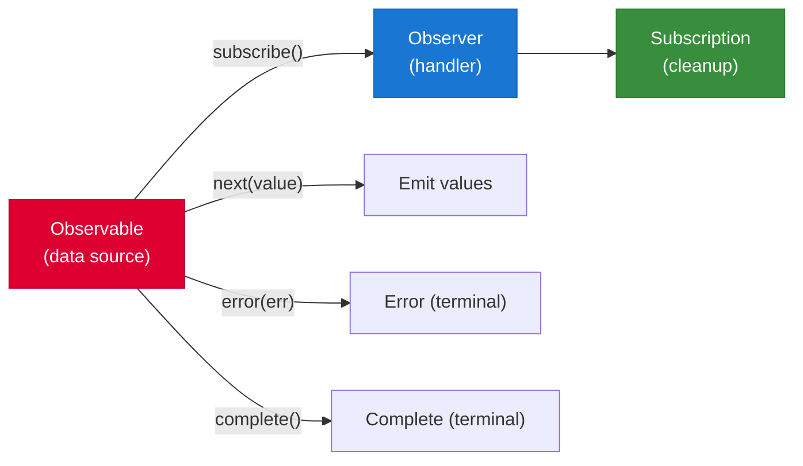
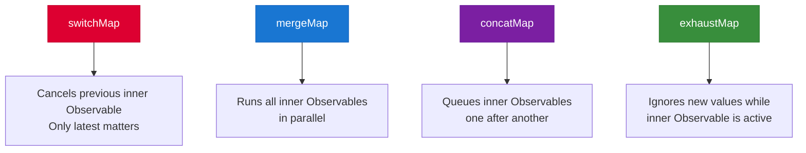

# RxJS Essentials

[&larr; HTTP Client](10-http-client.md) | [Next: State Management &rarr;](12-state-management.md)

---

RxJS (Reactive Extensions for JavaScript) provides the Observable pattern for handling asynchronous data streams. Angular uses it extensively for HTTP, routing, and forms. With [Signals](05-signals.md), you need less RxJS than before — but it remains essential for async workflows.

## Table of Contents

- [Core Concepts](#core-concepts)
- [Creating Observables](#creating-observables)
- [Essential Operators](#essential-operators)
- [Higher-Order Mapping](#higher-order-mapping)
- [Combination Operators](#combination-operators)
- [Subscription Management](#subscription-management)
- [Key Takeaways](#key-takeaways)

---

## Core Concepts

### Observable, Observer, Subscription



```typescript
import { Observable } from 'rxjs';

// An Observable emits values over time
const numbers$ = new Observable<number>(subscriber => {
  subscriber.next(1);
  subscriber.next(2);
  subscriber.next(3);
  subscriber.complete();
});

// Subscribe to receive values
const subscription = numbers$.subscribe({
  next: (value) => console.log(value),     // 1, 2, 3
  error: (err) => console.error(err),
  complete: () => console.log('Done')
});

// Unsubscribe when done
subscription.unsubscribe();
```

> **Convention:** Observable variable names end with `$` (e.g., `users$`, `click$`).

### Subject and BehaviorSubject

| Type | Has Initial Value? | Replays? | Use Case |
|------|--------------------|----------|----------|
| `Subject` | No | No | Event buses, multicasting |
| `BehaviorSubject` | Yes | Latest value | Stateful streams |
| `ReplaySubject` | No | Last N values | Cache recent values |

```typescript
import { BehaviorSubject } from 'rxjs';

// BehaviorSubject always has a current value
const theme$ = new BehaviorSubject<'light' | 'dark'>('light');

// New subscribers immediately get the current value
theme$.subscribe(t => console.log(t));  // 'light'

// Emit a new value
theme$.next('dark');  // all subscribers get 'dark'

// Read current value synchronously
console.log(theme$.value);  // 'dark'
```

> **Modern alternative:** For simple state, prefer [Signals](05-signals.md) over `BehaviorSubject`. See [Signals vs RxJS](signals-vs-rxjs.md).

---

## Creating Observables

```typescript
import { of, from, interval, timer, fromEvent, EMPTY, throwError } from 'rxjs';

// From static values
const nums$ = of(1, 2, 3);

// From an array, promise, or iterable
const arr$ = from([10, 20, 30]);
const promise$ = from(fetch('/api/data'));

// Timed emissions
const every1s$ = interval(1000);          // 0, 1, 2, ... every second
const after3s$ = timer(3000);             // emits 0 after 3 seconds
const delayed$ = timer(2000, 1000);       // wait 2s, then emit every 1s

// From DOM events
const clicks$ = fromEvent(document, 'click');

// Utilities
const empty$ = EMPTY;                     // completes immediately
const error$ = throwError(() => new Error('fail'));
```

---

## Essential Operators

Operators transform, filter, and combine Observable streams using the `pipe()` method.

### Transformation

```typescript
import { map, tap, scan } from 'rxjs';

// map — transform each value
const doubled$ = numbers$.pipe(
  map(n => n * 2)
);

// tap — side effect without changing the stream (great for logging)
const logged$ = numbers$.pipe(
  tap(n => console.log('Before:', n)),
  map(n => n * 2),
  tap(n => console.log('After:', n))
);

// scan — accumulate values (like Array.reduce, but emits each step)
const runningTotal$ = numbers$.pipe(
  scan((total, n) => total + n, 0)
);  // emits: 1, 3, 6
```

### Filtering

```typescript
import { filter, distinctUntilChanged, take, skip, first, last, debounceTime, throttleTime } from 'rxjs';

// filter — keep only values matching a condition
const evens$ = numbers$.pipe(filter(n => n % 2 === 0));

// distinctUntilChanged — skip consecutive duplicates
const unique$ = values$.pipe(distinctUntilChanged());

// take / skip — limit emissions
const firstThree$ = numbers$.pipe(take(3));
const skipTwo$ = numbers$.pipe(skip(2));

// debounceTime — wait for a pause in emissions (great for search inputs)
const search$ = searchInput$.pipe(
  debounceTime(300),         // wait 300ms after last keystroke
  distinctUntilChanged()     // skip if value hasn't changed
);

// throttleTime — emit at most once per interval
const scroll$ = scrollEvents$.pipe(
  throttleTime(100)          // at most one event per 100ms
);
```

### Operator Visual: debounceTime

```
Input:  --a--b--c--------d--e-------->
                    300ms        300ms
Output: ----------------c---------e--->
```

---

## Higher-Order Mapping

These operators map each value to an inner Observable and manage subscriptions automatically. This is the most important concept in RxJS for Angular development.



### switchMap (Most Common)

Cancels the previous inner Observable when a new value arrives:

```typescript
import { switchMap } from 'rxjs';

// Search: cancel previous request when user types again
searchInput$.pipe(
  debounceTime(300),
  distinctUntilChanged(),
  switchMap(term => this.http.get<Result[]>(`/api/search?q=${term}`))
).subscribe(results => this.results.set(results));
```

### concatMap

Processes one at a time, in order:

```typescript
import { concatMap } from 'rxjs';

// Save items one at a time, in order
items$.pipe(
  concatMap(item => this.http.post('/api/items', item))
).subscribe();
```

### mergeMap

Processes all in parallel:

```typescript
import { mergeMap } from 'rxjs';

// Fetch all user details in parallel
userIds$.pipe(
  mergeMap(id => this.http.get<User>(`/api/users/${id}`))
).subscribe();
```

### exhaustMap

Ignores new values while the current one is processing:

```typescript
import { exhaustMap } from 'rxjs';

// Prevent double-submit: ignore clicks while request is in flight
submitClick$.pipe(
  exhaustMap(() => this.http.post('/api/orders', this.form.value))
).subscribe();
```

### Quick Decision Guide

| Operator | Cancel? | Parallel? | Best For |
|----------|---------|-----------|----------|
| `switchMap` | Yes | No | Search, autocomplete, route changes |
| `concatMap` | No | No | Sequential writes, ordered operations |
| `mergeMap` | No | Yes | Parallel independent requests |
| `exhaustMap` | Ignores | No | Button clicks, form submissions |

---

## Combination Operators

### combineLatest

Emit when any source emits (with latest from all):

```typescript
import { combineLatest } from 'rxjs';

const filters$ = combineLatest([
  category$,
  priceRange$,
  sortBy$
]).pipe(
  switchMap(([category, price, sort]) =>
    this.http.get('/api/products', { params: { category, ...price, sort } })
  )
);
```

### forkJoin

Wait for all Observables to complete, then emit all results:

```typescript
import { forkJoin } from 'rxjs';

// Load multiple resources in parallel, wait for all
forkJoin({
  users: this.http.get<User[]>('/api/users'),
  products: this.http.get<Product[]>('/api/products'),
  config: this.http.get<Config>('/api/config')
}).subscribe(({ users, products, config }) => {
  // All three loaded
});
```

### withLatestFrom

Combine with the latest value from another Observable (doesn't trigger on the other):

```typescript
import { withLatestFrom } from 'rxjs';

saveClick$.pipe(
  withLatestFrom(formData$),
  switchMap(([_, data]) => this.http.post('/api/save', data))
).subscribe();
```

---

## Subscription Management

Unmanaged subscriptions cause memory leaks. Here are the patterns for proper cleanup:

### Pattern 1: DestroyRef + takeUntilDestroyed (Recommended)

```typescript
import { Component, inject, DestroyRef } from '@angular/core';
import { takeUntilDestroyed } from '@angular/core/rxjs-interop';

@Component({ ... })
export class SearchComponent {
  private destroyRef = inject(DestroyRef);

  constructor() {
    interval(1000).pipe(
      takeUntilDestroyed(this.destroyRef)
    ).subscribe(n => console.log(n));
  }
}
```

### Pattern 2: toSignal (Best When Possible)

Convert Observable to signal — Angular handles the subscription:

```typescript
import { toSignal } from '@angular/core/rxjs-interop';

@Component({
  template: `<p>Count: {{ count() }}</p>`
})
export class TimerComponent {
  count = toSignal(interval(1000), { initialValue: 0 });
}
```

### Pattern 3: async Pipe

The template subscribes and unsubscribes automatically:

```typescript
@Component({
  imports: [AsyncPipe],
  template: `<p>{{ data$ | async }}</p>`
})
export class DataComponent {
  data$ = this.http.get<string>('/api/data');
}
```

### Pattern 4: Manual Cleanup (When Needed)

```typescript
export class MyComponent implements OnDestroy {
  private subscription = new Subscription();

  constructor() {
    this.subscription.add(
      source1$.subscribe(...)
    );
    this.subscription.add(
      source2$.subscribe(...)
    );
  }

  ngOnDestroy() {
    this.subscription.unsubscribe();
  }
}
```

### Which to Use?

| Pattern | When |
|---------|------|
| `toSignal()` | Displaying Observable data in templates |
| `takeUntilDestroyed()` | Subscriptions with side effects in components |
| `async` pipe | Simple template bindings (pre-signals pattern) |
| `Subscription` | Complex multi-subscription scenarios |

> **Note:** `HttpClient` GET/POST/etc. complete after one emission — they don't leak. Cleanup matters for long-lived streams (intervals, WebSockets, `valueChanges`).

---

## Key Takeaways

- **Observables** are lazy streams of values over time
- **Operators** transform streams via `pipe()` — `map`, `filter`, `switchMap` are most common
- **switchMap** for search/autocomplete, **exhaustMap** for button clicks, **concatMap** for ordered writes
- **combineLatest** combines multiple streams; **forkJoin** waits for all to complete
- Always clean up subscriptions: prefer `toSignal()` or `takeUntilDestroyed()`
- With signals, you need less RxJS — see [Signals vs RxJS](signals-vs-rxjs.md)

---

## Free Resources

> **Official:** [RxJS Interop](https://angular.dev/guide/signals/rxjs-interop) — `toSignal()`, `toObservable()`, and bridging signals with RxJS
>
> **YouTube:** [RxJS in Angular — What You Need to Know](https://www.youtube.com/@JoshuaMorony) — Joshua Morony's pragmatic take on which RxJS operators actually matter in the signals era
>
> **YouTube:** [Top RxJS Operators for Angular Developers](https://www.youtube.com/@DecodedFrontend) — Decoded Frontend on `switchMap`, `combineLatest`, `takeUntilDestroyed`, and error handling
>
> **Interactive:** [RxJS Marbles](https://rxmarbles.com/) — interactive marble diagrams for every RxJS operator, invaluable for building intuition

---

**Related:**
- [Signals vs RxJS](signals-vs-rxjs.md) — when to use which
- [Signals](05-signals.md) — Angular's newer reactive primitive
- [HTTP Client](10-http-client.md) — HTTP returns Observables
- [State Management](12-state-management.md) — NgRx patterns use Observables

---

[&larr; HTTP Client](10-http-client.md) | [Next: State Management &rarr;](12-state-management.md)
