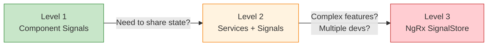
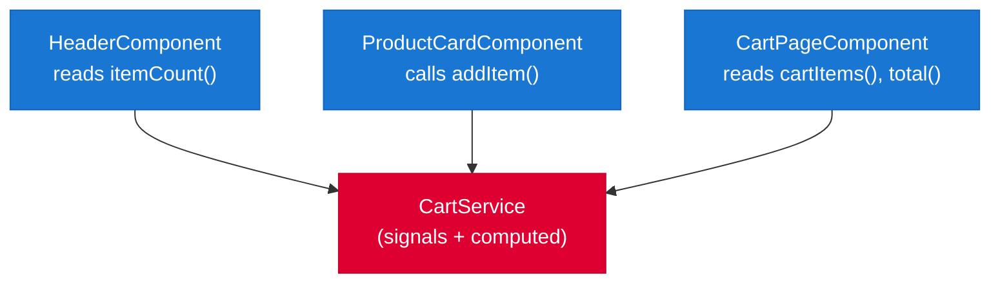
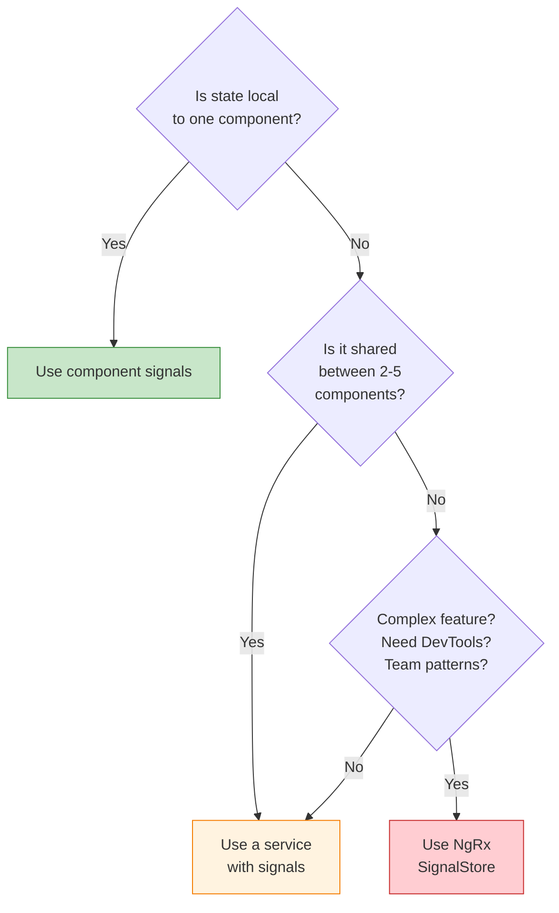

# State Management

[&larr; RxJS Essentials](11-rxjs.md) | [Next: Change Detection &rarr;](13-change-detection.md)

---

State management is how you organize and share data across your application. Angular provides a clear escalation path from simple signals to enterprise-grade stores.

## Table of Contents

- [The Escalation Path](#the-escalation-path)
- [Level 1: Component State with Signals](#level-1-component-state-with-signals)
- [Level 2: Shared State with Services](#level-2-shared-state-with-services)
- [Level 3: NgRx SignalStore](#level-3-ngrx-signalstore)
- [Choosing the Right Level](#choosing-the-right-level)
- [Key Takeaways](#key-takeaways)

---

## The Escalation Path



**Start simple. Escalate only when you feel pain.** Most apps only need Levels 1 and 2.

---

## Level 1: Component State with Signals

For state that belongs to a single component:

```typescript
import { Component, signal, computed } from '@angular/core';

@Component({
  selector: 'app-todo-list',
  template: `
    <input #input (keyup.enter)="add(input)" />
    <p>{{ remaining() }} of {{ todos().length }} remaining</p>
    
    @for (todo of todos(); track todo.id) {
      <div>
        <input type="checkbox" 
               [checked]="todo.done" 
               (change)="toggle(todo.id)" />
        <span [class.done]="todo.done">{{ todo.text }}</span>
      </div>
    }
  `
})
export class TodoListComponent {
  todos = signal<Todo[]>([
    { id: 1, text: 'Learn signals', done: false },
    { id: 2, text: 'Build an app', done: false }
  ]);

  remaining = computed(() => 
    this.todos().filter(t => !t.done).length
  );

  add(input: HTMLInputElement) {
    const text = input.value.trim();
    if (!text) return;
    this.todos.update(list => [
      ...list, 
      { id: Date.now(), text, done: false }
    ]);
    input.value = '';
  }

  toggle(id: number) {
    this.todos.update(list =>
      list.map(t => t.id === id ? { ...t, done: !t.done } : t)
    );
  }
}
```

**Use when:** State is local to one component and doesn't need to be shared.

---

## Level 2: Shared State with Services

For state shared between multiple components. This is the sweet spot for most Angular apps.

```typescript
// cart.service.ts
import { Injectable, signal, computed } from '@angular/core';

export interface CartItem {
  productId: number;
  name: string;
  price: number;
  quantity: number;
}

@Injectable({ providedIn: 'root' })
export class CartService {
  // Private writable signal
  private items = signal<CartItem[]>([]);

  // Public read-only derived state
  readonly cartItems = this.items.asReadonly();
  readonly itemCount = computed(() => 
    this.items().reduce((sum, item) => sum + item.quantity, 0)
  );
  readonly total = computed(() => 
    this.items().reduce((sum, item) => sum + item.price * item.quantity, 0)
  );
  readonly isEmpty = computed(() => this.items().length === 0);

  addItem(product: { id: number; name: string; price: number }) {
    this.items.update(items => {
      const existing = items.find(i => i.productId === product.id);
      if (existing) {
        return items.map(i => 
          i.productId === product.id 
            ? { ...i, quantity: i.quantity + 1 } 
            : i
        );
      }
      return [...items, { 
        productId: product.id, 
        name: product.name, 
        price: product.price, 
        quantity: 1 
      }];
    });
  }

  removeItem(productId: number) {
    this.items.update(items => items.filter(i => i.productId !== productId));
  }

  clear() {
    this.items.set([]);
  }
}
```

### Using the Service

```typescript
// header.component.ts — shows cart count
@Component({
  selector: 'app-header',
  template: `<span class="badge">{{ cart.itemCount() }}</span>`
})
export class HeaderComponent {
  cart = inject(CartService);
}

// product-card.component.ts — adds to cart
@Component({
  selector: 'app-product-card',
  template: `
    <h3>{{ product().name }}</h3>
    <button (click)="cart.addItem(product())">Add to Cart</button>
  `
})
export class ProductCardComponent {
  product = input.required<Product>();
  cart = inject(CartService);
}

// cart-page.component.ts — displays full cart
@Component({
  selector: 'app-cart-page',
  template: `
    @for (item of cart.cartItems(); track item.productId) {
      <div>{{ item.name }} x{{ item.quantity }} — {{ item.price * item.quantity | currency }}</div>
    } @empty {
      <p>Cart is empty.</p>
    }
    <p>Total: {{ cart.total() | currency }}</p>
  `
})
export class CartPageComponent {
  cart = inject(CartService);
}
```

### The Pattern



**Use when:** Multiple components need to read/write the same state.

---

## Level 3: NgRx SignalStore

For complex features requiring structured state management with extensibility. NgRx SignalStore provides a pattern for organizing state, actions, and side effects.

```bash
npm install @ngrx/signals
```

### Basic SignalStore

```typescript
import { signalStore, withState, withComputed, withMethods, patchState } from '@ngrx/signals';
import { computed, inject } from '@angular/core';
import { HttpClient } from '@angular/common/http';
import { pipe, switchMap, tap } from 'rxjs';
import { rxMethod } from '@ngrx/signals/rxjs-interop';

interface TodoState {
  todos: Todo[];
  loading: boolean;
  filter: 'all' | 'active' | 'completed';
}

const initialState: TodoState = {
  todos: [],
  loading: false,
  filter: 'all'
};

export const TodoStore = signalStore(
  { providedIn: 'root' },
  withState(initialState),

  withComputed((store) => ({
    filteredTodos: computed(() => {
      const todos = store.todos();
      const filter = store.filter();
      switch (filter) {
        case 'active': return todos.filter(t => !t.done);
        case 'completed': return todos.filter(t => t.done);
        default: return todos;
      }
    }),
    todoCount: computed(() => store.todos().length),
    activeCount: computed(() => store.todos().filter(t => !t.done).length)
  })),

  withMethods((store) => {
    const http = inject(HttpClient);

    return {
      setFilter(filter: 'all' | 'active' | 'completed') {
        patchState(store, { filter });
      },

      addTodo(text: string) {
        const newTodo: Todo = { id: Date.now(), text, done: false };
        patchState(store, { todos: [...store.todos(), newTodo] });
      },

      toggleTodo(id: number) {
        patchState(store, {
          todos: store.todos().map(t => 
            t.id === id ? { ...t, done: !t.done } : t
          )
        });
      },

      loadTodos: rxMethod<void>(
        pipe(
          tap(() => patchState(store, { loading: true })),
          switchMap(() => http.get<Todo[]>('/api/todos')),
          tap(todos => patchState(store, { todos, loading: false }))
        )
      )
    };
  })
);
```

### Using SignalStore

```typescript
@Component({
  selector: 'app-todos',
  providers: [TodoStore],  // or use { providedIn: 'root' } in the store
  template: `
    @if (store.loading()) {
      <app-spinner />
    }

    <div class="filters">
      <button (click)="store.setFilter('all')">All ({{ store.todoCount() }})</button>
      <button (click)="store.setFilter('active')">Active ({{ store.activeCount() }})</button>
      <button (click)="store.setFilter('completed')">Completed</button>
    </div>

    @for (todo of store.filteredTodos(); track todo.id) {
      <div (click)="store.toggleTodo(todo.id)">
        {{ todo.done ? '✓' : '○' }} {{ todo.text }}
      </div>
    }
  `
})
export class TodosComponent {
  readonly store = inject(TodoStore);

  constructor() {
    this.store.loadTodos();
  }
}
```

**Use when:** Complex feature state, team needs consistent patterns, need extensibility (custom store features).

---

## Choosing the Right Level

| Criteria | Level 1 (Component) | Level 2 (Service) | Level 3 (SignalStore) |
|----------|---------------------|--------------------|-----------------------|
| State scope | Single component | Shared across components | Feature or app-wide |
| Complexity | Simple | Moderate | Complex |
| Team size | Any | Any | Multiple developers |
| Boilerplate | Minimal | Low | Moderate |
| Structure | Freeform | Convention-based | Opinionated |
| DevTools | No | No | NgRx DevTools |
| Testing | Easy | Easy | Structured |

### Decision Flow



---

## Key Takeaways

- **Start with component signals** — the simplest state management
- **Escalate to services with signals** when state needs to be shared
- **Use NgRx SignalStore** for complex features needing structured patterns
- Private `signal()` + public `asReadonly()` + `computed()` is the core pattern
- Most apps only need Levels 1 and 2
- Don't adopt NgRx until you feel the pain of unstructured shared state

---

## Free Resources

> **YouTube:** [State Management with Angular Signals](https://www.youtube.com/@JoshuaMorony) — Joshua Morony covers lightweight state management with signals and services before reaching for a library
>
> **YouTube:** [NgRx Signal Store — Complete Guide](https://www.youtube.com/@RainerHahnekamp) — Rainer Hahnekamp (NgRx core contributor) gives the most authoritative walkthrough of `@ngrx/signals`
>
> **Official:** [NgRx Signal Store Docs](https://ngrx.io/guide/signals/signal-store) — the official NgRx docs with practical examples for signalStore, patchState, and rxMethod

---

**Related:**
- [Signals](05-signals.md) — the reactive primitive powering all three levels
- [Services & DI](07-services-and-di.md) — services as state containers
- [Signals vs RxJS](signals-vs-rxjs.md) — reactive model comparison
- [Change Detection](13-change-detection.md) — how signals optimize rendering

---

[&larr; RxJS Essentials](11-rxjs.md) | [Next: Change Detection &rarr;](13-change-detection.md)
