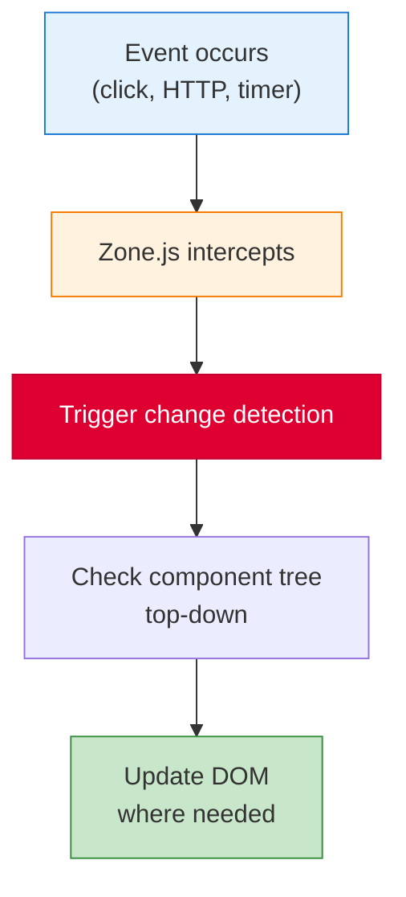
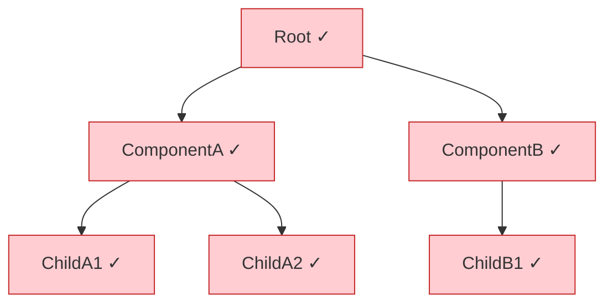
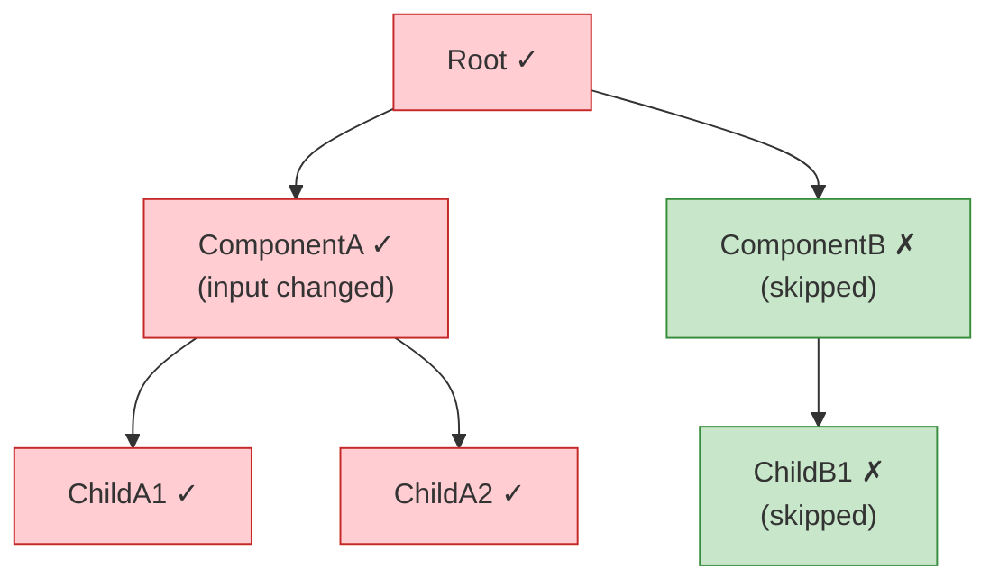
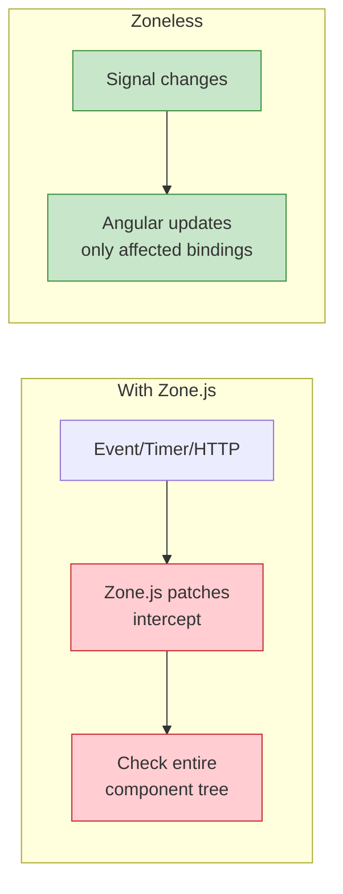

# Change Detection

[&larr; State Management](12-state-management.md) | [Next: Testing &rarr;](14-testing.md)

---

Change detection is how Angular keeps the DOM in sync with your component data. Understanding it is key to building performant applications.

## Table of Contents

- [How It Works](#how-it-works)
- [Default vs OnPush](#default-vs-onpush)
- [Signals and Change Detection](#signals-and-change-detection)
- [Zoneless Angular](#zoneless-angular)
- [Key Takeaways](#key-takeaways)

---

## How It Works

When something happens (a click, HTTP response, timer), Angular checks whether component data has changed and updates the DOM accordingly.



### Zone.js

Zone.js is a library that patches async APIs (setTimeout, Promise, addEventListener, etc.) to notify Angular when async operations complete. This triggers change detection automatically.

```typescript
// Zone.js automatically triggers change detection after:
setTimeout(() => { ... });       // patched
fetch('/api/data');              // patched
element.addEventListener(...);   // patched
Promise.resolve().then(...);     // patched
```

---

## Default vs OnPush

### Default Strategy

Angular checks the component **on every change detection cycle**, regardless of whether its data changed:



Every component is checked even if only ComponentA's data changed.

### OnPush Strategy

Angular only checks the component when:
1. An `input()` reference changes
2. An event handler fires within the component
3. A signal read in the template changes
4. `markForCheck()` is called
5. An `async` pipe receives a new value

```typescript
@Component({
  selector: 'app-user-card',
  changeDetection: ChangeDetectionStrategy.OnPush,  // opt in
  template: `<h3>{{ user().name }}</h3>`
})
export class UserCardComponent {
  user = input.required<User>();
}
```



### Use OnPush Everywhere

OnPush is **recommended for all components**. It prevents unnecessary checks and works naturally with signals and immutable data.

```typescript
// Common pitfall: mutating objects doesn't trigger OnPush
// ❌ BAD
this.user.name = 'Updated';  // same reference, OnPush won't detect

// ✅ GOOD — create a new reference
this.user = { ...this.user, name: 'Updated' };

// ✅ BEST — use signals (always works with OnPush)
this.user.update(u => ({ ...u, name: 'Updated' }));
```

---

## Signals and Change Detection

Signals provide the most efficient change detection. Angular knows exactly which template expressions depend on which signals, so it only updates the affected DOM nodes.

```typescript
@Component({
  changeDetection: ChangeDetectionStrategy.OnPush,
  template: `
    <h1>{{ title() }}</h1>          <!-- updates when title changes -->
    <p>{{ description() }}</p>      <!-- updates when description changes -->
    <span>{{ count() }}</span>      <!-- updates when count changes -->
  `
})
export class MyComponent {
  title = signal('Hello');
  description = signal('Welcome');
  count = signal(0);

  increment() {
    this.count.update(n => n + 1);
    // Only the <span> is re-evaluated, not <h1> or <p>
  }
}
```

### Why Signals Are Better for Change Detection

| Approach | What Gets Checked |
|----------|------------------|
| Default (no signals) | Entire component tree |
| OnPush (no signals) | Component + children when input changes |
| Signals + OnPush | Only the specific DOM bindings that changed |
| Signals + Zoneless | Same as above, without Zone.js overhead |

---

## Zoneless Angular

Zoneless Angular removes the Zone.js dependency entirely. Instead of patching every async API, Angular relies on signals to know exactly when to update the DOM.

### Enabling Zoneless

```typescript
// app.config.ts
import { provideExperimentalZonelessChangeDetection } from '@angular/core';

export const appConfig: ApplicationConfig = {
  providers: [
    provideExperimentalZonelessChangeDetection()
    // Remove provideZoneChangeDetection()
  ]
};
```

### Benefits

- **Smaller bundle** — Zone.js is ~13KB gzipped
- **Better performance** — no monkey-patching of browser APIs
- **Simpler debugging** — async stack traces aren't modified
- **Faster initial load** — one fewer script to load and evaluate

### Requirements

For zoneless to work, your app must:
1. Use **signals** for all reactive state
2. Use **OnPush** change detection (or signals handle it automatically)
3. Not rely on Zone.js for triggering change detection

```typescript
// ❌ Won't trigger updates in zoneless (no signal, no event)
setTimeout(() => {
  this.title = 'Updated';  // Zone.js used to catch this
}, 1000);

// ✅ Works in zoneless
setTimeout(() => {
  this.title.set('Updated');  // Signal notifies Angular
}, 1000);
```

### Zoneless vs Zone.js



> Zoneless is in developer preview. Check [Angular docs](https://angular.dev) for the latest status. See [Performance](16-performance.md) for more optimization strategies.

---

## Key Takeaways

- Change detection syncs component data with the DOM
- **Default** checks everything; **OnPush** checks only when inputs, events, or signals change
- **Use OnPush on all components** — it's the recommended strategy
- **Signals** give Angular fine-grained knowledge of what changed
- **Zoneless** removes Zone.js — smaller bundles, better performance
- Don't mutate objects — always create new references (immutable updates)

---

**Related:**
- [Signals](05-signals.md) — the reactive primitive that powers fine-grained change detection
- [Performance](16-performance.md) — OnPush, signals, and other optimizations
- [Advanced Patterns](18-advanced-patterns.md) — zoneless migration, more on change detection

---

[&larr; State Management](12-state-management.md) | [Next: Testing &rarr;](14-testing.md)
