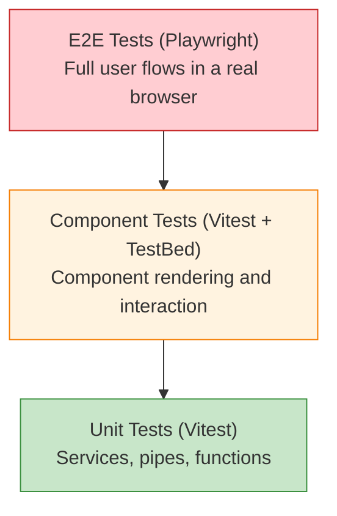

# Testing

[&larr; Change Detection](13-change-detection.md) | [Next: SSR & Hydration &rarr;](15-ssr-and-hydration.md)

---

Angular applications are tested at multiple levels: unit tests for individual pieces, component tests for UI behavior, and end-to-end tests for full user flows.

## Table of Contents

- [Testing Stack](#testing-stack)
- [Unit Testing with Vitest](#unit-testing-with-vitest)
- [Component Testing](#component-testing)
- [Testing Services](#testing-services)
- [Testing with Signals](#testing-with-signals)
- [E2E Testing with Playwright](#e2e-testing-with-playwright)
- [Key Takeaways](#key-takeaways)

---

## Testing Stack



| Level | Tool | Speed | Scope |
|-------|------|-------|-------|
| Unit | Vitest | Fast | Functions, services, pipes |
| Component | Vitest + TestBed | Medium | Component rendering, interaction |
| E2E | Playwright | Slow | Full app in a browser |

> **Vitest** replaced Karma/Jasmine as the default test runner in Angular 21. If you're on an older version, the APIs are similar.

---

## Unit Testing with Vitest

### Running Tests

```bash
ng test              # run all tests
ng test --watch      # watch mode
ng test --coverage   # with coverage report
```

### Testing a Simple Function

```typescript
// math.utils.ts
export function clamp(value: number, min: number, max: number): number {
  return Math.min(Math.max(value, min), max);
}
```

```typescript
// math.utils.spec.ts
import { describe, it, expect } from 'vitest';
import { clamp } from './math.utils';

describe('clamp', () => {
  it('should return the value when within range', () => {
    expect(clamp(5, 0, 10)).toBe(5);
  });

  it('should clamp to min when below range', () => {
    expect(clamp(-5, 0, 10)).toBe(0);
  });

  it('should clamp to max when above range', () => {
    expect(clamp(15, 0, 10)).toBe(10);
  });
});
```

### Testing a Pipe

```typescript
// truncate.pipe.spec.ts
import { TruncatePipe } from './truncate.pipe';

describe('TruncatePipe', () => {
  const pipe = new TruncatePipe();

  it('should not truncate short strings', () => {
    expect(pipe.transform('Hello', 10)).toBe('Hello');
  });

  it('should truncate long strings with default suffix', () => {
    expect(pipe.transform('Hello World', 5)).toBe('Hello...');
  });

  it('should use custom suffix', () => {
    expect(pipe.transform('Hello World', 5, '…')).toBe('Hello…');
  });
});
```

---

## Component Testing

### Basic Component Test

```typescript
// greeting.component.ts
@Component({
  selector: 'app-greeting',
  template: `<h1>Hello, {{ name() }}!</h1>`
})
export class GreetingComponent {
  name = input('World');
}
```

```typescript
// greeting.component.spec.ts
import { ComponentFixture, TestBed } from '@angular/core/testing';
import { GreetingComponent } from './greeting.component';

describe('GreetingComponent', () => {
  let fixture: ComponentFixture<GreetingComponent>;
  let component: GreetingComponent;

  beforeEach(async () => {
    await TestBed.configureTestingModule({
      imports: [GreetingComponent]
    }).compileComponents();

    fixture = TestBed.createComponent(GreetingComponent);
    component = fixture.componentInstance;
  });

  it('should display default greeting', () => {
    fixture.detectChanges();
    const h1 = fixture.nativeElement.querySelector('h1');
    expect(h1.textContent).toBe('Hello, World!');
  });

  it('should display custom name', () => {
    fixture.componentRef.setInput('name', 'Angular');
    fixture.detectChanges();
    const h1 = fixture.nativeElement.querySelector('h1');
    expect(h1.textContent).toBe('Hello, Angular!');
  });
});
```

### Testing User Interaction

```typescript
// counter.component.spec.ts
describe('CounterComponent', () => {
  let fixture: ComponentFixture<CounterComponent>;

  beforeEach(async () => {
    await TestBed.configureTestingModule({
      imports: [CounterComponent]
    }).compileComponents();
    fixture = TestBed.createComponent(CounterComponent);
  });

  it('should increment count on button click', () => {
    fixture.detectChanges();
    
    const button = fixture.nativeElement.querySelector('button');
    const display = fixture.nativeElement.querySelector('.count');
    
    expect(display.textContent).toContain('0');
    
    button.click();
    fixture.detectChanges();
    
    expect(display.textContent).toContain('1');
  });
});
```

### Testing with Dependencies

```typescript
// user-list.component.spec.ts
describe('UserListComponent', () => {
  let fixture: ComponentFixture<UserListComponent>;

  beforeEach(async () => {
    const mockUserService = {
      allUsers: signal<User[]>([
        { id: 1, name: 'Ada', email: 'ada@test.com' },
        { id: 2, name: 'Grace', email: 'grace@test.com' }
      ]),
      userCount: computed(() => 2)
    };

    await TestBed.configureTestingModule({
      imports: [UserListComponent],
      providers: [
        { provide: UserService, useValue: mockUserService }
      ]
    }).compileComponents();

    fixture = TestBed.createComponent(UserListComponent);
  });

  it('should display all users', () => {
    fixture.detectChanges();
    const items = fixture.nativeElement.querySelectorAll('p');
    expect(items.length).toBe(2);
    expect(items[0].textContent).toContain('Ada');
  });
});
```

---

## Testing Services

### Simple Service Test

```typescript
// calculator.service.spec.ts
describe('CalculatorService', () => {
  let service: CalculatorService;

  beforeEach(() => {
    TestBed.configureTestingModule({});
    service = TestBed.inject(CalculatorService);
  });

  it('should add two numbers', () => {
    expect(service.add(2, 3)).toBe(5);
  });
});
```

### Service with HTTP

```typescript
// user.service.spec.ts
import { provideHttpClient } from '@angular/common/http';
import { HttpTestingController, provideHttpClientTesting } from '@angular/common/http/testing';

describe('UserService', () => {
  let service: UserService;
  let httpMock: HttpTestingController;

  beforeEach(() => {
    TestBed.configureTestingModule({
      providers: [
        provideHttpClient(),
        provideHttpClientTesting()
      ]
    });
    service = TestBed.inject(UserService);
    httpMock = TestBed.inject(HttpTestingController);
  });

  afterEach(() => {
    httpMock.verify();  // ensure no outstanding requests
  });

  it('should fetch users', () => {
    const mockUsers: User[] = [
      { id: 1, name: 'Ada', email: 'ada@test.com' }
    ];

    service.getUsers().subscribe(users => {
      expect(users).toEqual(mockUsers);
    });

    const req = httpMock.expectOne('/api/users');
    expect(req.request.method).toBe('GET');
    req.flush(mockUsers);  // respond with mock data
  });

  it('should handle 404 error', () => {
    service.getUserById(999).subscribe({
      error: (err) => {
        expect(err.message).toContain('not found');
      }
    });

    const req = httpMock.expectOne('/api/users/999');
    req.flush('Not found', { status: 404, statusText: 'Not Found' });
  });
});
```

---

## Testing with Signals

Signals work naturally in tests — read them with `()`, write them with `set()`:

```typescript
describe('CartService', () => {
  let service: CartService;

  beforeEach(() => {
    TestBed.configureTestingModule({});
    service = TestBed.inject(CartService);
  });

  it('should start empty', () => {
    expect(service.isEmpty()).toBe(true);
    expect(service.itemCount()).toBe(0);
  });

  it('should add items', () => {
    service.addItem({ id: 1, name: 'Widget', price: 10 });
    
    expect(service.isEmpty()).toBe(false);
    expect(service.itemCount()).toBe(1);
    expect(service.total()).toBe(10);
  });

  it('should increment quantity for existing items', () => {
    service.addItem({ id: 1, name: 'Widget', price: 10 });
    service.addItem({ id: 1, name: 'Widget', price: 10 });

    expect(service.itemCount()).toBe(2);  // quantity, not distinct items
    expect(service.total()).toBe(20);
  });
});
```

---

## E2E Testing with Playwright

### Setup

```bash
ng e2e  # will offer to set up Playwright if not configured
```

### Example Test

```typescript
// e2e/app.spec.ts
import { test, expect } from '@playwright/test';

test.describe('App', () => {
  test('should display the home page', async ({ page }) => {
    await page.goto('/');
    await expect(page.locator('h1')).toContainText('Welcome');
  });

  test('should navigate to about page', async ({ page }) => {
    await page.goto('/');
    await page.click('a[href="/about"]');
    await expect(page).toHaveURL('/about');
    await expect(page.locator('h1')).toContainText('About');
  });

  test('should add item to cart', async ({ page }) => {
    await page.goto('/products');
    await page.click('text=Add to Cart');
    
    const badge = page.locator('.cart-badge');
    await expect(badge).toContainText('1');
  });

  test('should submit login form', async ({ page }) => {
    await page.goto('/login');
    await page.fill('input[name="email"]', 'test@example.com');
    await page.fill('input[name="password"]', 'password123');
    await page.click('button[type="submit"]');
    
    await expect(page).toHaveURL('/dashboard');
  });
});
```

---

## Testing Best Practices

| Practice | Description |
|----------|-------------|
| Test behavior, not implementation | Assert what the user sees, not internal state |
| Use `fixture.componentRef.setInput()` | The correct way to set signal inputs in tests |
| Call `fixture.detectChanges()` | After changing state, trigger change detection |
| Prefer `provideHttpClientTesting()` | Over manual HTTP mocks |
| Keep tests independent | Each test should set up its own state |
| Mock at boundaries | Mock HTTP, not internal services |

---

## Key Takeaways

- **Vitest** is the modern test runner for Angular (replaced Karma)
- **TestBed** sets up the Angular testing environment for components and services
- Use `fixture.componentRef.setInput()` to set signal-based inputs
- **HttpTestingController** intercepts HTTP requests in tests
- **Playwright** handles E2E testing in real browsers
- Test **behavior** (what the user sees) over **implementation** (internal methods)

---

**Related:**
- [Components](02-components.md) — what you're testing
- [Services & DI](07-services-and-di.md) — mocking services in tests
- [HTTP Client](10-http-client.md) — testing HTTP calls
- [Signals](05-signals.md) — testing signal-based state

---

[&larr; Change Detection](13-change-detection.md) | [Next: SSR & Hydration &rarr;](15-ssr-and-hydration.md)
