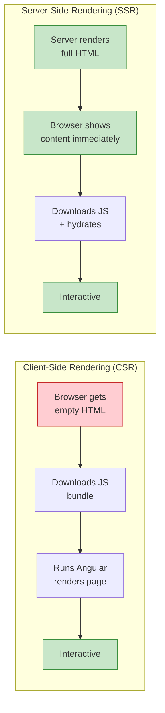
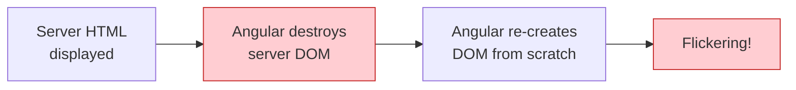
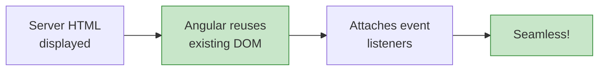
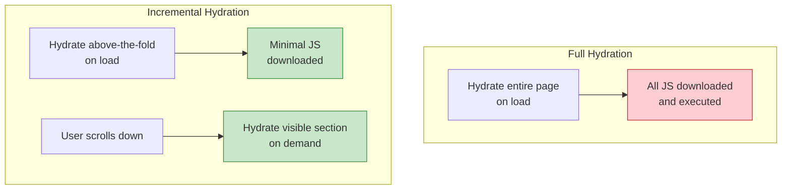

# SSR & Hydration

[&larr; Testing](14-testing.md) | [Next: Performance &rarr;](16-performance.md)

---

Server-Side Rendering (SSR) generates HTML on the server for faster initial loads and better SEO. Hydration makes that server-rendered HTML interactive without re-rendering from scratch.

## Table of Contents

- [Why SSR?](#why-ssr)
- [Rendering Modes](#rendering-modes)
- [Setting Up SSR](#setting-up-ssr)
- [Hydration](#hydration)
- [Incremental Hydration](#incremental-hydration)
- [Route-Level Render Mode](#route-level-render-mode)
- [Key Takeaways](#key-takeaways)

---

## Why SSR?



| Benefit | Description |
|---------|-------------|
| **Faster First Paint** | User sees content before JS loads |
| **SEO** | Search engines index real HTML content |
| **Social Sharing** | Link previews show actual content |
| **Performance** | Less work for the browser on initial load |

---

## Rendering Modes

Angular supports three rendering modes, configurable per route:

| Mode | When HTML Is Generated | Interactive? | Use Case |
|------|----------------------|--------------|----------|
| **CSR** (Client) | At runtime, in browser | After JS loads | Dashboards, admin panels |
| **SSR** (Server) | At request time, on server | After hydration | Dynamic content, personalized pages |
| **SSG** (Prerender) | At build time | After hydration | Static content, marketing pages |

---

## Setting Up SSR

### New Project

```bash
ng new my-app --ssr
```

### Existing Project

```bash
ng add @angular/ssr
```

This creates:
- `server.ts` — the Express server
- `src/app/app.config.server.ts` — server-side configuration
- Updates `angular.json` with server build configuration

### Server Configuration

```typescript
// app.config.server.ts
import { mergeApplicationConfig, ApplicationConfig } from '@angular/core';
import { provideServerRendering } from '@angular/platform-server';
import { provideServerRoutesConfig } from '@angular/ssr';
import { appConfig } from './app.config';
import { serverRoutes } from './app.routes.server';

const serverConfig: ApplicationConfig = {
  providers: [
    provideServerRendering(),
    provideServerRoutesConfig(serverRoutes)
  ]
};

export const config = mergeApplicationConfig(appConfig, serverConfig);
```

---

## Hydration

Hydration is the process of making server-rendered HTML interactive. Instead of destroying and re-creating DOM elements, Angular reuses them.

### Without Hydration (Legacy)



### With Hydration (Modern)



Hydration is enabled by default in Angular 17+. No extra configuration needed.

### Handling Non-Hydratable Content

Some content can't be hydrated (e.g., content that differs between server and client):

```typescript
import { afterNextRender } from '@angular/core';

@Component({
  template: `
    <p>Current time: {{ time }}</p>
  `
})
export class ClockComponent {
  time = '--:--';

  constructor() {
    afterNextRender(() => {
      // Only runs in the browser, after hydration
      this.time = new Date().toLocaleTimeString();
    });
  }
}
```

### Skip Hydration for Specific Elements

```html
<div ngSkipHydration>
  <!-- This subtree will be re-rendered client-side -->
  <app-third-party-widget />
</div>
```

---

## Incremental Hydration

Incremental hydration defers the hydration of parts of the page until they're needed. Combined with [`@defer`](04-control-flow.md#defer--lazy-loading-blocks), it means components below the fold aren't hydrated until the user scrolls to them.

```html
<!-- Server renders this content, but doesn't hydrate it until visible -->
@defer (on viewport; hydrate on viewport) {
  <app-comments [postId]="postId" />
} @placeholder {
  <p>Comments</p>
}
```

### Hydration Triggers

| Trigger | Hydrates When |
|---------|--------------|
| `hydrate on viewport` | Element scrolls into view |
| `hydrate on interaction` | User clicks, focuses, etc. |
| `hydrate on hover` | User hovers over the element |
| `hydrate on idle` | Browser is idle |
| `hydrate on timer(2s)` | After a delay |
| `hydrate on immediate` | As soon as possible |
| `hydrate when condition` | A boolean becomes true |
| `hydrate never` | Never hydrate (static content) |

### Performance Impact



---

## Route-Level Render Mode

Configure rendering strategy per route:

```typescript
// app.routes.server.ts
import { RenderMode, ServerRoute } from '@angular/ssr';

export const serverRoutes: ServerRoute[] = [
  { path: '', renderMode: RenderMode.Prerender },           // SSG — built at compile time
  { path: 'about', renderMode: RenderMode.Prerender },      // SSG
  { path: 'dashboard', renderMode: RenderMode.Client },     // CSR — no server rendering
  { path: 'products/:id', renderMode: RenderMode.Server },  // SSR — rendered per request
  { path: '**', renderMode: RenderMode.Server }             // SSR default
];
```

### Prerendering with Parameters

For SSG routes with dynamic parameters, provide the paths at build time:

```typescript
{
  path: 'blog/:slug',
  renderMode: RenderMode.Prerender,
  async getPrerenderParams() {
    // Return all slugs to prerender
    const posts = await fetch('https://api.example.com/posts');
    const data = await posts.json();
    return data.map((post: any) => ({ slug: post.slug }));
  }
}
```

---

## SSR Considerations

### Browser-Only APIs

The server has no `window`, `document`, or `localStorage`. Use guards:

```typescript
import { isPlatformBrowser } from '@angular/common';
import { inject, PLATFORM_ID } from '@angular/core';

export class MyComponent {
  private platformId = inject(PLATFORM_ID);

  saveToLocalStorage(key: string, value: string) {
    if (isPlatformBrowser(this.platformId)) {
      localStorage.setItem(key, value);
    }
  }
}
```

Or use `afterNextRender()` / `afterRender()`:

```typescript
import { afterNextRender } from '@angular/core';

export class ChartComponent {
  constructor() {
    afterNextRender(() => {
      // Safe — only runs in the browser
      const chart = new ThirdPartyChart(this.el.nativeElement);
      chart.render(this.data());
    });
  }
}
```

### HTTP in SSR

HTTP requests made during SSR are automatically cached and transferred to the client, avoiding duplicate requests. This works out of the box with `provideHttpClient()`.

---

## Key Takeaways

- **SSR** renders HTML on the server for faster initial loads and SEO
- **Hydration** reuses server-rendered DOM instead of re-creating it
- **Incremental hydration** defers hydration of below-the-fold content
- Configure **per-route render modes**: Prerender (SSG), Server (SSR), or Client (CSR)
- Guard browser-only APIs with `isPlatformBrowser()` or `afterNextRender()`
- HTTP transfer state prevents duplicate requests between server and client

---

## Free Resources

> **Official:** [SSR Guide](https://angular.dev/guide/ssr) | [Hydration](https://angular.dev/guide/hydration) — server-side rendering and hydration documentation
>
> **YouTube:** [Angular SSR — Complete Guide](https://www.youtube.com/@DecodedFrontend) — Decoded Frontend covers `@angular/ssr`, setup, and hydration
>
> **YouTube:** [Angular Hydration Explained](https://www.youtube.com/@JoshuaMorony) — Joshua Morony on full and incremental hydration, `@defer` on the server, and `withEventReplay()`

---

**Related:**
- [Control Flow — @defer](04-control-flow.md#defer--lazy-loading-blocks) — lazy rendering that pairs with incremental hydration
- [Performance](16-performance.md) — SSR as a performance strategy
- [Routing](08-routing.md) — routes define what gets rendered
- [Deployment](19-deployment.md) — deploying SSR applications

---

[&larr; Testing](14-testing.md) | [Next: Performance &rarr;](16-performance.md)
