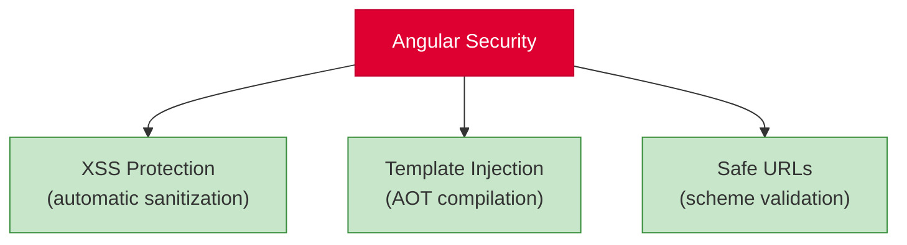
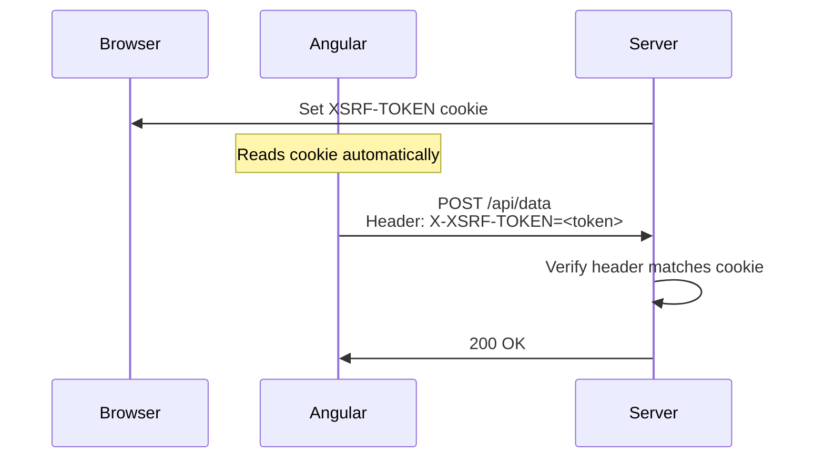

# Security

[&larr; Performance](16-performance.md) | [Next: Advanced Patterns &rarr;](18-advanced-patterns.md)

---

Angular has strong built-in security defaults. This guide covers what Angular protects against automatically and what you need to handle yourself.

## Table of Contents

- [Angular's Built-In Protections](#angulars-built-in-protections)
- [XSS Prevention](#xss-prevention)
- [CSRF Protection](#csrf-protection)
- [Content Security Policy](#content-security-policy)
- [Common Vulnerabilities to Avoid](#common-vulnerabilities-to-avoid)
- [Key Takeaways](#key-takeaways)

---

## Angular's Built-In Protections



Angular **automatically sanitizes** values in templates:

| Context | What Angular Does | Example |
|---------|------------------|---------|
| HTML interpolation | Escapes HTML entities | `{{ userInput }}` is safe |
| Property binding | Sanitizes dangerous values | `[innerHTML]="value"` is sanitized |
| URL binding | Blocks `javascript:` URLs | `[href]="url"` is checked |
| Style binding | Sanitizes CSS expressions | `[style]="value"` is sanitized |

```typescript
// Angular automatically escapes this — the <script> tag renders as text
@Component({
  template: `<p>{{ userComment }}</p>`
})
export class CommentComponent {
  userComment = '<script>alert("xss")</script>Hello';
  // Renders: <script>alert("xss")</script>Hello (as text, not executed)
}
```

---

## XSS Prevention

### Interpolation Is Safe by Default

```html
<!-- ✅ Safe — Angular escapes HTML entities -->
{{ untrustedInput }}

<!-- ✅ Safe — Angular sanitizes the HTML -->
<div [innerHTML]="untrustedHtml"></div>
```

### Bypassing Sanitization (Use With Care)

Sometimes you need to render trusted HTML (e.g., from a CMS). Use `DomSanitizer`:

```typescript
import { Component, inject } from '@angular/core';
import { DomSanitizer, SafeHtml } from '@angular/platform-browser';

@Component({
  template: `<div [innerHTML]="trustedHtml"></div>`
})
export class ArticleComponent {
  private sanitizer = inject(DomSanitizer);
  
  trustedHtml: SafeHtml;

  constructor() {
    // Only bypass sanitization for content YOU control
    this.trustedHtml = this.sanitizer.bypassSecurityTrustHtml(
      '<h2>Trusted Content</h2><p>From your own CMS</p>'
    );
  }
}
```

> **Warning:** Never bypass sanitization for user-provided content. Only use `bypassSecurityTrust*` methods for content from trusted sources (your own CMS, admin-generated content).

### `DomSanitizer` Methods

| Method | For |
|--------|-----|
| `bypassSecurityTrustHtml()` | HTML content |
| `bypassSecurityTrustStyle()` | CSS styles |
| `bypassSecurityTrustScript()` | Scripts (rarely needed) |
| `bypassSecurityTrustUrl()` | URLs |
| `bypassSecurityTrustResourceUrl()` | Resource URLs (iframes, etc.) |

---

## CSRF Protection

Cross-Site Request Forgery (CSRF) attacks trick a user's browser into making unwanted requests. Angular supports the common cookie-to-header pattern:

```typescript
// app.config.ts
import { provideHttpClient, withXsrfConfiguration } from '@angular/common/http';

export const appConfig: ApplicationConfig = {
  providers: [
    provideHttpClient(
      withXsrfConfiguration({
        cookieName: 'XSRF-TOKEN',     // cookie set by your server
        headerName: 'X-XSRF-TOKEN'    // header Angular sends back
      })
    )
  ]
};
```

### How It Works



> Your backend must set the XSRF cookie and validate the header. Angular handles the client side automatically.

---

## Content Security Policy

A Content Security Policy (CSP) header tells the browser which resources are allowed to load. Configure it on your server:

```
Content-Security-Policy: 
  default-src 'self';
  script-src 'self';
  style-src 'self' 'unsafe-inline';
  img-src 'self' data: https:;
  connect-src 'self' https://api.example.com;
```

### Angular and CSP

- Angular's AOT compiler generates code that works without `eval()` or `new Function()`
- Inline styles require `'unsafe-inline'` (Angular generates scoped styles)
- For strict CSP, use nonces:

```typescript
// In angular.json or build configuration
{
  "projects": {
    "my-app": {
      "architect": {
        "build": {
          "options": {
            "security": {
              "autoCsp": true  // Angular automatically handles CSP nonces
            }
          }
        }
      }
    }
  }
}
```

---

## Common Vulnerabilities to Avoid

### 1. Don't Construct URLs from User Input

```typescript
// ❌ BAD: URL injection risk
const url = `/api/users/${userInput}`;
this.http.get(url);

// ✅ GOOD: Use HttpParams
this.http.get('/api/users', {
  params: { search: userInput }
});
```

### 2. Don't Use `innerHTML` with User Content

```html
<!-- ❌ BAD: Even though Angular sanitizes, avoid when possible -->
<div [innerHTML]="userComment"></div>

<!-- ✅ GOOD: Use interpolation (always escaped) -->
<p>{{ userComment }}</p>
```

### 3. Don't Disable Sanitization for User Input

```typescript
// ❌ NEVER DO THIS with user-provided content
this.sanitizer.bypassSecurityTrustHtml(userProvidedHtml);
```

### 4. Validate on the Server Too

Client-side validation improves UX but provides no security. Always validate on the server:

```typescript
// Client-side validation (for UX)
this.form = this.fb.group({
  email: ['', [Validators.required, Validators.email]],
  age: ['', [Validators.min(0), Validators.max(150)]]
});

// Server MUST also validate — client-side checks can be bypassed
```

### 5. Don't Store Secrets in Client Code

```typescript
// ❌ BAD: Visible in the browser's JavaScript
const API_KEY = 'sk-secret-key-12345';

// ✅ GOOD: Proxy through your backend
// Frontend calls your server, server calls the external API with the key
```

### 6. Use HttpOnly Cookies for Auth Tokens

```typescript
// ❌ Risky: Token in localStorage is accessible to XSS
localStorage.setItem('token', authToken);

// ✅ Safer: HttpOnly cookie (set by server, not accessible to JS)
// Server sets: Set-Cookie: token=...; HttpOnly; Secure; SameSite=Strict
```

---

## Security Audit Checklist

| Check | Status |
|-------|--------|
| Never bypass sanitization for user input | |
| HTTP calls use parameterized queries | |
| CSRF protection configured | |
| Authentication tokens in HttpOnly cookies | |
| No secrets in client-side code | |
| Server-side validation for all inputs | |
| CSP headers configured | |
| Dependencies regularly updated (`ng update`) | |

---

## Key Takeaways

- Angular **automatically sanitizes** template bindings to prevent XSS
- **Never bypass sanitization** for user-provided content
- Configure **CSRF protection** with `withXsrfConfiguration()`
- Use **CSP headers** to restrict resource loading
- **Always validate on the server** — client-side validation is for UX only
- Store auth tokens in **HttpOnly cookies**, not `localStorage`
- Keep dependencies updated with `ng update`

---

**Related:**
- [HTTP Client](10-http-client.md) — interceptors for auth and CSRF
- [Forms](09-forms.md) — client-side validation
- [Deployment](19-deployment.md) — production security headers

---

[&larr; Performance](16-performance.md) | [Next: Advanced Patterns &rarr;](18-advanced-patterns.md)
