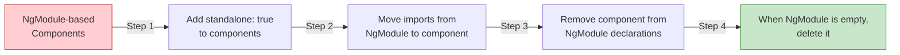

# Advanced Patterns

[&larr; Security](17-security.md) | [Next: Deployment &rarr;](19-deployment.md)

---

This section covers advanced Angular features for experienced developers: animations, internationalization, dynamic components, and migration patterns.

## Table of Contents

- [Animations](#animations)
- [Internationalization (i18n)](#internationalization-i18n)
- [Dynamic Components](#dynamic-components)
- [Custom Structural Directives](#custom-structural-directives)
- [NgModule Migration](#ngmodule-migration)
- [Key Takeaways](#key-takeaways)

---

## Animations

Angular's animation system is built on the Web Animations API and provides declarative, state-based transitions.

### Setup

```typescript
// app.config.ts
import { provideAnimationsAsync } from '@angular/platform-browser/animations/async';

export const appConfig: ApplicationConfig = {
  providers: [
    provideAnimationsAsync()  // lazy-loads the animation code
  ]
};
```

### Basic Fade Animation

```typescript
import { Component } from '@angular/core';
import { trigger, transition, style, animate } from '@angular/animations';

@Component({
  selector: 'app-toast',
  template: `
    @if (visible) {
      <div @fadeInOut class="toast">{{ message }}</div>
    }
  `,
  animations: [
    trigger('fadeInOut', [
      transition(':enter', [
        style({ opacity: 0, transform: 'translateY(-20px)' }),
        animate('300ms ease-out', style({ opacity: 1, transform: 'translateY(0)' }))
      ]),
      transition(':leave', [
        animate('200ms ease-in', style({ opacity: 0, transform: 'translateY(-20px)' }))
      ])
    ])
  ]
})
export class ToastComponent {
  visible = true;
  message = 'Operation successful!';
}
```

### State-Based Animations

```typescript
import { trigger, state, transition, style, animate } from '@angular/animations';

@Component({
  template: `
    <div [@expandCollapse]="isExpanded ? 'expanded' : 'collapsed'" class="panel">
      <p>Panel content</p>
    </div>
    <button (click)="isExpanded = !isExpanded">Toggle</button>
  `,
  animations: [
    trigger('expandCollapse', [
      state('collapsed', style({ height: '0', overflow: 'hidden', opacity: 0 })),
      state('expanded', style({ height: '*', opacity: 1 })),
      transition('collapsed <=> expanded', animate('300ms ease-in-out'))
    ])
  ]
})
export class PanelComponent {
  isExpanded = false;
}
```

### Route Transitions

Animate between route changes:

```typescript
import { trigger, transition, style, animate, query, group } from '@angular/animations';

export const routeAnimation = trigger('routeAnimation', [
  transition('* <=> *', [
    query(':enter, :leave', style({ position: 'absolute', width: '100%' }), { optional: true }),
    group([
      query(':leave', [
        animate('200ms ease-out', style({ opacity: 0 }))
      ], { optional: true }),
      query(':enter', [
        style({ opacity: 0 }),
        animate('300ms 100ms ease-in', style({ opacity: 1 }))
      ], { optional: true })
    ])
  ])
]);
```

```html
<div [@routeAnimation]="outlet.activatedRouteData">
  <router-outlet #outlet="outlet" />
</div>
```

> **Alternative:** Angular also supports CSS-based view transitions via `withViewTransitions()` in the router. This is simpler for route animations. See [Routing](08-routing.md).

---

## Internationalization (i18n)

### Built-In i18n

Angular's built-in i18n generates a separate bundle per locale:

```html
<!-- Mark text for translation -->
<h1 i18n="site header|Main greeting for users">Welcome to our app!</h1>

<!-- With a custom ID for stable translations -->
<p i18n="@@introMessage">This is the introduction.</p>

<!-- Pluralization -->
<p i18n>{count, plural, 
  =0 {No items}
  =1 {One item}
  other {{{count}} items}
}</p>
```

```bash
# Extract translation file
ng extract-i18n --output-path src/locale

# Build for a specific locale
ng build --localize
```

### Translation File (XLIFF)

```xml
<!-- src/locale/messages.fr.xlf -->
<trans-unit id="introMessage">
  <source>This is the introduction.</source>
  <target>C'est l'introduction.</target>
</trans-unit>
```

### Configure Locales

```json
// angular.json
{
  "projects": {
    "my-app": {
      "i18n": {
        "sourceLocale": "en",
        "locales": {
          "fr": "src/locale/messages.fr.xlf",
          "de": "src/locale/messages.de.xlf"
        }
      }
    }
  }
}
```

### Runtime i18n (Alternative)

For dynamic locale switching without rebuilding, consider libraries like `@ngx-translate/core` or `@jsverse/transloco`.

---

## Dynamic Components

Create components programmatically at runtime:

### Using `ViewContainerRef`

```typescript
import { Component, ViewContainerRef, inject, Type } from '@angular/core';

@Component({
  selector: 'app-dynamic-host',
  template: `<ng-container #container />`
})
export class DynamicHostComponent {
  private vcr = inject(ViewContainerRef);

  loadComponent<T>(component: Type<T>, inputs?: Record<string, unknown>) {
    this.vcr.clear();
    const ref = this.vcr.createComponent(component);
    
    if (inputs) {
      for (const [key, value] of Object.entries(inputs)) {
        ref.setInput(key, value);
      }
    }
    
    return ref;
  }
}
```

### Lazy-Load Dynamic Components

```typescript
async loadEditor() {
  const { EditorComponent } = await import('./editor.component');
  this.loadComponent(EditorComponent, { content: this.content });
}
```

### CDK Portals (Alternative)

The Angular CDK provides a `Portal` system for rendering content dynamically:

```typescript
import { CdkPortal, CdkPortalOutlet, TemplatePortal } from '@angular/cdk/portal';
```

---

## Custom Structural Directives

While [Control Flow](04-control-flow.md) covers most cases, you can create custom structural directives:

### Permission Directive

```typescript
import { Directive, inject, input, TemplateRef, ViewContainerRef, effect } from '@angular/core';
import { AuthService } from './auth.service';

@Directive({
  selector: '[appIfRole]'
})
export class IfRoleDirective {
  appIfRole = input.required<string>();

  private templateRef = inject(TemplateRef);
  private vcr = inject(ViewContainerRef);
  private auth = inject(AuthService);

  constructor() {
    effect(() => {
      const requiredRole = this.appIfRole();
      const userRole = this.auth.currentUser()?.role;

      this.vcr.clear();
      if (userRole === requiredRole) {
        this.vcr.createEmbeddedView(this.templateRef);
      }
    });
  }
}
```

```html
<!-- Only renders for admins -->
<button *appIfRole="'admin'">Delete All Users</button>
```

---

## NgModule Migration

Modern Angular uses standalone components by default. If you're working with a legacy NgModule-based codebase, here's how to migrate:

### The Migration Path



### Automated Migration

```bash
# Convert components to standalone
ng generate @angular/core:standalone

# Convert bootstrap to standalone
ng generate @angular/core:standalone --mode switch-to-standalone
```

### Manual Example

```typescript
// BEFORE (NgModule-based)
// app.module.ts
@NgModule({
  declarations: [AppComponent, HeaderComponent],
  imports: [BrowserModule, RouterModule.forRoot(routes)],
  bootstrap: [AppComponent]
})
export class AppModule {}

// AFTER (Standalone)
// No app.module.ts needed!

// main.ts
bootstrapApplication(AppComponent, appConfig);

// app.component.ts
@Component({
  selector: 'app-root',
  imports: [RouterOutlet, HeaderComponent],
  template: `
    <app-header />
    <router-outlet />
  `
})
export class AppComponent {}
```

### Coexistence

Standalone and NgModule-based components can coexist during migration:

```typescript
// Standalone component using an NgModule-based component
@Component({
  imports: [LegacyModule],  // import the module to access its components
  template: `<legacy-component />`
})
export class NewComponent {}
```

---

## Other Advanced Topics

### DestroyRef for Cleanup

```typescript
import { DestroyRef, inject } from '@angular/core';

export class MyComponent {
  private destroyRef = inject(DestroyRef);

  constructor() {
    const interval = setInterval(() => console.log('tick'), 1000);
    
    this.destroyRef.onDestroy(() => {
      clearInterval(interval);
    });
  }
}
```

### afterRender / afterNextRender

Execute code after Angular renders the DOM:

```typescript
import { afterRender, afterNextRender } from '@angular/core';

export class ChartComponent {
  constructor() {
    // Runs after every render cycle
    afterRender(() => {
      this.updateChartDimensions();
    });

    // Runs once after the first render
    afterNextRender(() => {
      this.initializeThirdPartyLib();
    });
  }
}
```

### Injection Context with `runInInjectionContext`

```typescript
import { runInInjectionContext, Injector, inject } from '@angular/core';

export class MyComponent {
  private injector = inject(Injector);

  laterMethod() {
    // Need inject() outside constructor? Use runInInjectionContext
    runInInjectionContext(this.injector, () => {
      const service = inject(SomeService);
      service.doSomething();
    });
  }
}
```

---

## Key Takeaways

- **Animations** use declarative triggers and state-based transitions
- **i18n** generates separate bundles per locale; consider runtime alternatives for dynamic switching
- **Dynamic components** can be created with `ViewContainerRef`
- **NgModule migration** has automated tooling — standalone and NgModules can coexist
- **DestroyRef** provides flexible cleanup without `OnDestroy`
- **afterRender/afterNextRender** safely interact with the DOM after rendering

---

## Free Resources

> **Official:** [Animations Guide](https://angular.dev/guide/animations) | [i18n Guide](https://angular.dev/guide/i18n) — animations and internationalization reference
>
> **YouTube:** [Angular Animations — Complete Guide](https://www.youtube.com/@DecodedFrontend) — Decoded Frontend covers triggers, transitions, query/stagger patterns
>
> **YouTube:** [Dynamic Components in Angular](https://www.youtube.com/@DecodedFrontend) — modern standalone dynamic component patterns with `ViewContainerRef`
>
> **Reference:** [Angular CDK](https://material.angular.io/cdk/categories) — an underused treasure trove of production utilities: overlay, drag-drop, virtual scrolling, clipboard, layout

---

**Related:**
- [Components](02-components.md) — the building blocks animated and dynamically created
- [Routing](08-routing.md) — view transitions between routes
- [Change Detection](13-change-detection.md) — zoneless Angular
- [Deployment](19-deployment.md) — deploying multi-locale builds

---

[&larr; Security](17-security.md) | [Next: Deployment &rarr;](19-deployment.md)
