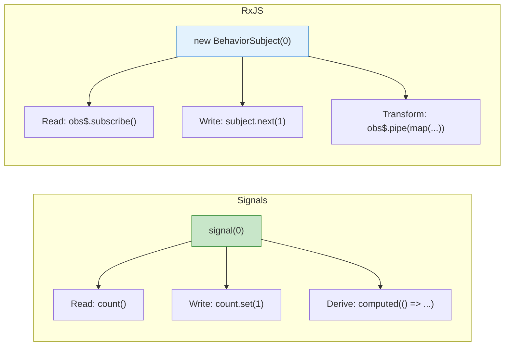
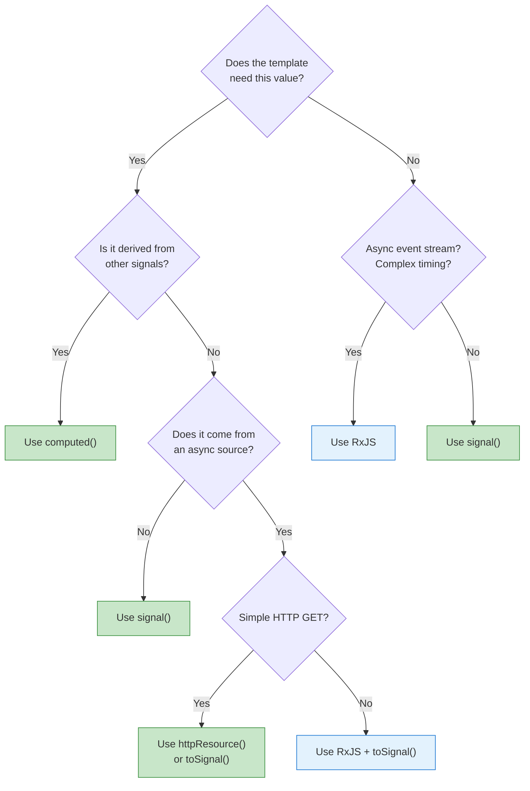

# Signals vs RxJS

[&larr; Back to Home](../README.md)

---

Angular now has two reactive primitives: **Signals** and **RxJS Observables**. This guide helps you decide which to use and when.

## Table of Contents

- [Fundamental Differences](#fundamental-differences)
- [When to Use Signals](#when-to-use-signals)
- [When to Use RxJS](#when-to-use-rxjs)
- [Bridging the Two](#bridging-the-two)
- [Decision Flowchart](#decision-flowchart)
- [Key Takeaways](#key-takeaways)

---

## Fundamental Differences



| Aspect | Signals | RxJS Observables |
|--------|---------|-----------------|
| **Model** | Pull (read when needed) | Push (values arrive over time) |
| **Sync/Async** | Always synchronous | Both sync and async |
| **Current value** | Always has one | May not have emitted yet |
| **Read syntax** | `count()` | `subscribe()` or `\| async` |
| **Write syntax** | `count.set(5)` | `subject.next(5)` |
| **Derive** | `computed(() => ...)` | `pipe(map(...))` |
| **Cleanup** | Automatic | Must unsubscribe |
| **Learning curve** | Low | High |
| **Glitch-free** | Yes | Depends on usage |
| **Angular integration** | Native (templates, inputs) | Requires `\| async` or `toSignal()` |

---

## When to Use Signals

Signals are the right choice for **synchronous state** that the UI depends on:

```typescript
// Component state
count = signal(0);
isOpen = signal(false);
selectedTab = signal<'home' | 'profile'>('home');

// Derived state
total = computed(() => this.price() * this.quantity());
filteredItems = computed(() => this.items().filter(i => i.active));

// Component inputs/outputs
name = input.required<string>();
clicked = output<void>();

// Shared state in services
@Injectable({ providedIn: 'root' })
export class ThemeService {
  theme = signal<'light' | 'dark'>('light');
  isDark = computed(() => this.theme() === 'dark');

  toggle() {
    this.theme.update(t => t === 'light' ? 'dark' : 'light');
  }
}
```

### Signals Are Best For

- UI state (open/closed, selected, active)
- Form state that components display
- Derived/computed values
- Simple shared state in services
- Component inputs and outputs
- Anything that templates read directly

---

## When to Use RxJS

RxJS is the right choice for **asynchronous event streams** and **complex composition**:

```typescript
// Search with debounce
searchResults$ = this.searchInput.valueChanges.pipe(
  debounceTime(300),
  distinctUntilChanged(),
  switchMap(term => this.http.get(`/api/search?q=${term}`))
);

// WebSocket messages
messages$ = webSocket('wss://chat.example.com').pipe(
  retry(3),
  share()
);

// Combine multiple async sources
dashboard$ = combineLatest([
  this.userService.getProfile(),
  this.orderService.getRecent(),
  interval(30000).pipe(switchMap(() => this.statsService.getStats()))
]).pipe(
  map(([profile, orders, stats]) => ({ profile, orders, stats }))
);

// Complex event handling
drag$ = fromEvent(element, 'mousedown').pipe(
  switchMap(() => fromEvent(document, 'mousemove').pipe(
    takeUntil(fromEvent(document, 'mouseup'))
  ))
);
```

### RxJS Is Best For

- HTTP requests (Angular's HttpClient returns Observables)
- WebSockets and real-time data streams
- Complex event composition (drag-and-drop, gestures)
- Debouncing, throttling, retrying
- Combining multiple async sources
- Anything with a "over time" dimension

---

## Bridging the Two

### Observable to Signal: `toSignal()`

```typescript
import { toSignal } from '@angular/core/rxjs-interop';

// Convert an Observable to a signal for use in templates
const users = toSignal(this.http.get<User[]>('/api/users'), {
  initialValue: []
});

// In template: {{ users().length }}

// With route params
const userId = toSignal(
  this.route.paramMap.pipe(map(p => p.get('id')!))
);
```

### Signal to Observable: `toObservable()`

```typescript
import { toObservable } from '@angular/core/rxjs-interop';

const searchTerm = signal('');
const searchTerm$ = toObservable(searchTerm);

// Now use RxJS operators
const results$ = searchTerm$.pipe(
  debounceTime(300),
  switchMap(term => this.http.get(`/api/search?q=${term}`))
);
```

### Common Pattern: Signal State + RxJS Side Effects

```typescript
@Injectable({ providedIn: 'root' })
export class SearchService {
  // State as signals (what the UI reads)
  query = signal('');
  results = signal<Result[]>([]);
  loading = signal(false);

  constructor() {
    // Side effects with RxJS (debounce + HTTP)
    toObservable(this.query).pipe(
      debounceTime(300),
      distinctUntilChanged(),
      tap(() => this.loading.set(true)),
      switchMap(q => q ? this.http.get<Result[]>(`/api/search?q=${q}`) : of([])),
      takeUntilDestroyed()
    ).subscribe(results => {
      this.results.set(results);
      this.loading.set(false);
    });
  }

  private http = inject(HttpClient);
}
```

---

## Decision Flowchart



---

## Side-by-Side Comparison

### Counter

```typescript
// Signals (simpler)
count = signal(0);
doubled = computed(() => this.count() * 2);
increment() { this.count.update(n => n + 1); }

// RxJS (overkill for this)
count$ = new BehaviorSubject(0);
doubled$ = this.count$.pipe(map(n => n * 2));
increment() { this.count$.next(this.count$.value + 1); }
```

### Search

```typescript
// Signals + RxJS (best of both)
query = signal('');
results = signal<Result[]>([]);

constructor() {
  toObservable(this.query).pipe(
    debounceTime(300),
    distinctUntilChanged(),
    switchMap(q => this.http.get<Result[]>(`/search?q=${q}`)),
    takeUntilDestroyed()
  ).subscribe(r => this.results.set(r));
}

// Pure RxJS (works but more boilerplate)
query$ = new Subject<string>();
results$ = this.query$.pipe(
  debounceTime(300),
  distinctUntilChanged(),
  switchMap(q => this.http.get<Result[]>(`/search?q=${q}`))
);
```

---

## Key Takeaways

| Use Signals For | Use RxJS For |
|----------------|-------------|
| UI state | Async event streams |
| Derived values (`computed`) | Debounce, throttle, retry |
| Component inputs/outputs | WebSockets |
| Simple shared state | Complex async composition |
| Template bindings | HTTP with complex pipelines |

- **Default to signals** — they're simpler and integrate better with Angular
- **Reach for RxJS** when you need time-based operators or async composition
- **Bridge with `toSignal()`/`toObservable()`** — they complement each other
- You don't need to choose one or the other — use both where each shines

---

## Free Resources

> **YouTube:** [Angular Signals vs RxJS — When to Use What](https://www.youtube.com/@JoshuaMorony) — Joshua Morony's practical decision guide for choosing between signals and RxJS
>
> **YouTube:** [Angular Signals: What, Why, and How](https://www.youtube.com/@debaborahkurata) — Deborah Kurata shows real patterns for bridging signals and RxJS
>
> **Interactive:** [RxJS Marbles](https://rxmarbles.com/) — visualize RxJS operators with interactive marble diagrams

---

**Related:**
- [Signals](05-signals.md) — full guide to Angular signals
- [RxJS Essentials](11-rxjs.md) — operators and patterns
- [State Management](12-state-management.md) — scaling state beyond components
- [HTTP Client](10-http-client.md) — httpResource() vs HttpClient

---

[&larr; Back to Home](../README.md)
